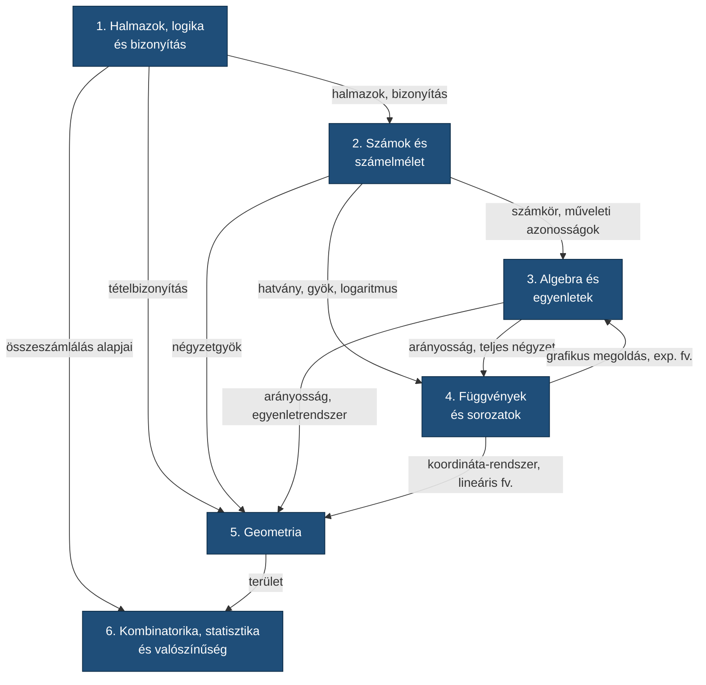
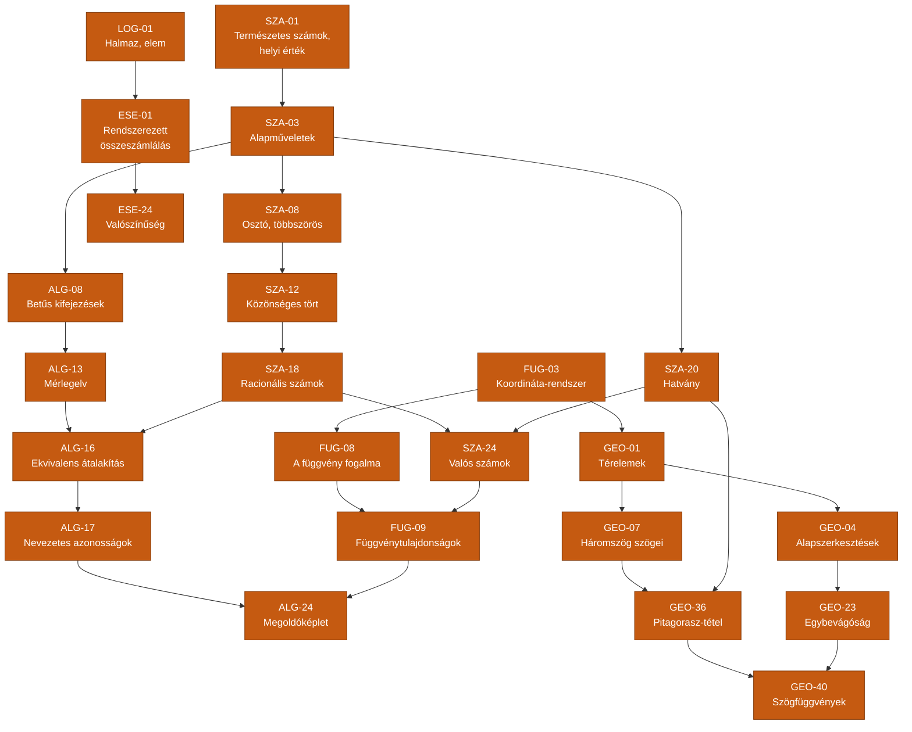

# Matematika Skillfa (5–12. évfolyam)

Ez a dokumentum a magyar gimnáziumi matematika tananyagát **tech tree / skillfa** formájában rendezi
– úgy, ahogy egy RPG vagy RTS képességfája épül fel.

A fa **nem az évfolyamokat követi**, hanem a **logikai függőségeket**: egy készséget akkor lehet
"felvenni", ha az összes előfeltétele már megvan. Ezért fordulhat elő, hogy 7. osztályos és
9. osztályos anyag ugyanabba a szintbe kerül, vagy hogy egy 6. osztályos fogalom csak jóval
később válik egy 12. osztályos készség előfeltételévé.

## Helyi POC futtatása

**Követelmény:** Node.js 20 vagy újabb. A POC egyetlen, helyi felhasználóra készült: a tudásszintek, profil és kiválasztott modell a böngésző `localStorage` tárában maradnak.

```powershell
npm install
$env:OPENROUTER_API_KEY = "sajat-openrouter-kulcs"
npm start
```

Az alkalmazás alapértelmezett címe `http://127.0.0.1:3000`. API-kulcs nélkül is használható a fa, az onboarding, a profil és a kézi tudásszint-kezelés; az AI-műveletek érthető konfigurációs hibát jeleznek. Az OpenRouter-modellt a fejléc **Beállítások** ablakában lehet kiválasztani a betöltött modellkatalógusból. A választás helyben megmarad, de AI-kérés csak kiválasztott modellel indítható.

Hasznos parancsok:

```powershell
npm start                 # helyi kiszolgáló
npm test                  # mockolt, hálózatmentes tesztek
npm run build:data        # a tantervi adatok újraépítése és ellenőrzése
```

### Feladatlap és nyomtatás

Egy készség paneljének **Gyakorlás** gombja külön feladatlap-oldalt nyit. Egyetlen szabad szöveges kérésben lehet megadni a gyakorlás fókuszát; az **Új feladatlap** új generálást indít, nem fűzi hozzá a korábbihoz. A **Feladatlap** és **Megoldókulcs** külön nézet, mindkettőnek saját nyomtatás gombja van. Nyomtatás előtt válaszd ki a kívánt nézetet; a nyomtatási stílus elrejti az alkalmazás vezérlőit. Generált feladatlap-előzmény nincs, és feladatmegoldás sem módosítja automatikusan a tudásszintet.

### Biztonsági határ

Az `OPENROUTER_API_KEY` kizárólag a helyi Node-szerver környezetében marad; a böngészőnek nem adódik át, és a hibaüzenetek sem tartalmazhatják. A modellnek küldött profil- és szabad szöveges kérés elhatárolt, nem megbízható adatként szerepel. A szerver a strukturált választ ellenőrzi, a felület pedig nem szúr be modell-szöveget HTML-ként.

## Hatókör

- **Célcsoport:** gimnáziumi tanuló, 5–12. évfolyam
- **Szint:** középszintű érettségi (a 2020-as NAT és a hozzá illeszkedő kerettantervek alapján)
- **Csomópontok száma:** 190 (281 él, ebből 35 ágak közötti; a leghosszabb tanulási út 15 lépés)
- **Nyelv:** magyar

Az interaktív változat felhasználói felületének terve: [docs/ux-terv.md](docs/ux-terv.md).

## Az ágak

| # | Ág | Kód | Csomópont | Fájl |
|---|----|-----|-----------|------|
| 1 | **Halmazok, logika és bizonyítás** – „a Gondolkodás ága" | `LOG` | 16 | [agak/01-halmazok-logika.md](agak/01-halmazok-logika.md) |
| 2 | **Számok és számelmélet** – „a Számok ága" | `SZA` | 33 | [agak/02-szamok-szamelmelet.md](agak/02-szamok-szamelmelet.md) |
| 3 | **Algebra és egyenletek** – „az Absztrakció ága" | `ALG` | 28 | [agak/03-algebra-egyenletek.md](agak/03-algebra-egyenletek.md) |
| 4 | **Függvények és sorozatok** – „a Változás ága" | `FUG` | 23 | [agak/04-fuggvenyek-sorozatok.md](agak/04-fuggvenyek-sorozatok.md) |
| 5 | **Geometria** – „a Tér ága" | `GEO` | 61 | [agak/05-geometria.md](agak/05-geometria.md) |
| 6 | **Kombinatorika, statisztika és valószínűség** – „az Esély ága" | `ESE` | 29 | [agak/06-kombinatorika-statisztika-valoszinuseg.md](agak/06-kombinatorika-statisztika-valoszinuseg.md) |

## Jelmagyarázat

- **ID** – a készség egyedi azonosítója (`ÁG-sorszám`), erre hivatkoznak az előfeltételek.
- **Szint** – a fában elfoglalt mélység. Egy szint minden csomópontja párhuzamosan tanulható,
  ha az előfeltételei megvannak. A szint **nem évfolyam**.
- **Előfeltétel** – azok a készségek, amelyek nélkül a csomópont nem érthető meg.
  A más ágból érkező előfeltételeket a gráfok **szaggatott vonallal** és halvány kitöltéssel jelölik.
- **Kapunode** (⭐) – olyan csomópont, amelyre sok másik épül; ha itt elakadsz, sok minden beomlik utána.

## Az ágak közötti kapcsolatok



## A fa gerince — a legfontosabb kapunode-ok

Ez a "fő ösvény": ha ezek megvannak, a fa nagy része elérhetővé válik.



## Ajánlott „build order"-ek

Több érvényes sorrend létezik. Néhány tipikus haladási stratégia:

### 1. „Kiegyensúlyozott" (a kerettanterv alapértelmezett útja)
Minden ágon párhuzamosan haladsz, spirálisan visszatérve.
`SZA` → `LOG`/`ESE` → `ALG` → `GEO` → `FUG`, majd újra elölről magasabb szinten.

### 2. „Algebra rush" (érettségi-orientált)
A számolási készség kiépítése után egyenesen az egyenletmegoldásra fókuszálsz:
`SZA-01…SZA-19` → `ALG-08…ALG-16` → `ALG-17…ALG-24` → `FUG-08…FUG-12`.
Ezzel a középszintű érettségi feladatsorának kb. felét lefeded.

### 3. „Geometria fókusz"
`GEO-01…GEO-14` (alakzatok) → `GEO-15…GEO-22` (mérés) → `GEO-23…GEO-35` (transzformációk)
→ `GEO-36…GEO-45` (nevezetes tételek, trigonometria) → `GEO-46…GEO-61` (tér- és koordinátageometria).
Vigyázat: a `GEO-36` (Pitagorasz) előfeltétele az `SZA-22` (négyzetgyök), a `GEO-40`
(szögfüggvények) pedig hasonlóságot igényel.

### 4. „Adat és esély"
`ESE-12…ESE-16` (leíró statisztika) → `ESE-01…ESE-06` (kombinatorika)
→ `ESE-21…ESE-29` (valószínűség). Viszonylag függetlenül tanulható a többi ágtól.

## Hogyan használd

1. Válaszd ki a célkészséget (pl. `ALG-24` – megoldóképlet).
2. Kövesd visszafelé az előfeltételeket, amíg olyan csomóponthoz nem érsz, amit már tudsz.
3. Onnan haladj előre. A szintek megmutatják, mi tanulható párhuzamosan.

## Forrás

A tartalom a 2020-as Nemzeti alaptanterv és a hozzá illeszkedő kerettantervek matematika
tananyagából származik:

- [Kerettanterv az általános iskola 5–8. évfolyama számára – Matematika](https://www.oktatas.hu/pub_bin/dload/kozoktatas/kerettanterv/Matematika_F.docx)
- [Kerettanterv a gimnáziumok 9–12. évfolyama számára – Matematika](https://www.oktatas.hu/pub_bin/dload/kozoktatas/kerettanterv/Matematika_K.docx)
- [5/2020. (I. 31.) Korm. rendelet – Nemzeti alaptanterv](https://njt.hu/jogszabaly/2020-5-20-22.0)

A csomópontokra bontás, a szintezés és a függőségi élek szerkesztői döntések: a kerettanterv
témaköreit és fogalomjegyzékeit bontják tanulási sorrendbe.
