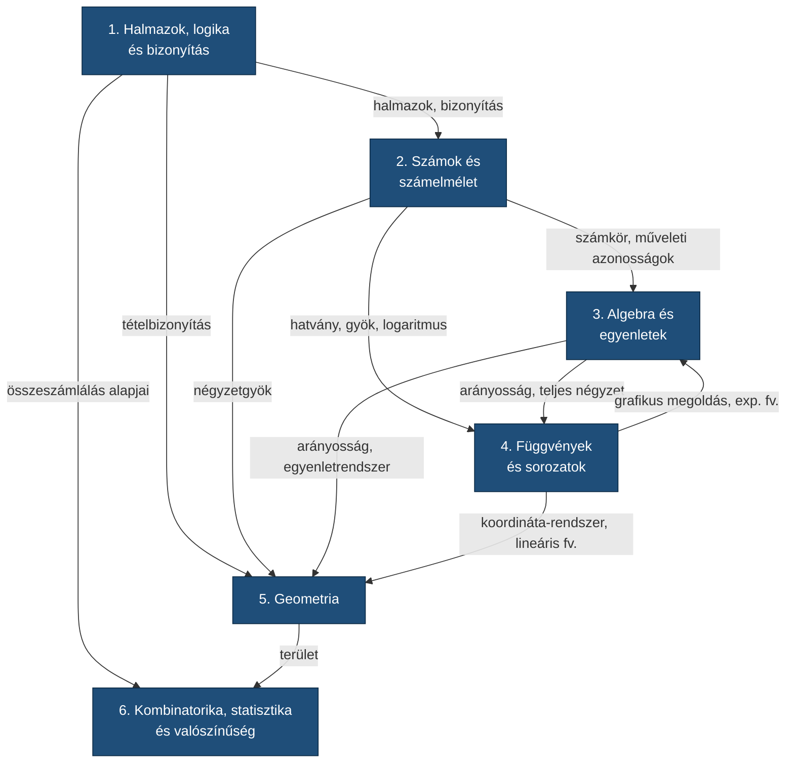
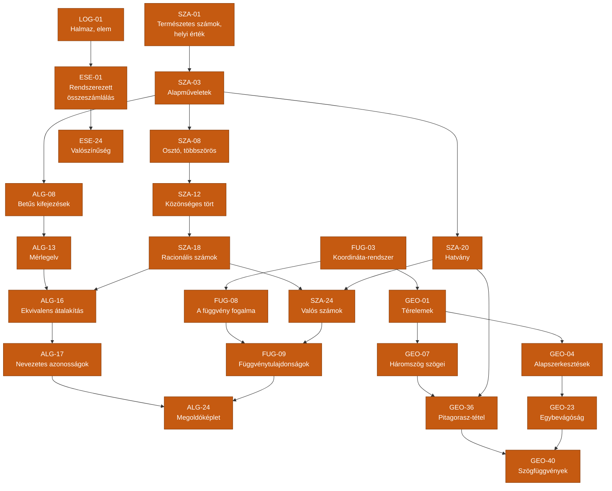

# MathRecap

MathRecap is an interactive skill tree for the Hungarian secondary-school mathematics curriculum (grades 5-12). Instead of following school years, it maps the prerequisite relationships between 190 concepts, so learners can see what they know, what is available next, and what each topic unlocks.

The interface and curriculum content are currently in Hungarian. Learners set their own mastery level, inspect prerequisites and follow-up topics, and can create printable AI-assisted practice worksheets when an OpenRouter API key is configured on the local server. Generated examples can follow the learner's stated interests, making practice more personally relevant.

**Current scope:** MathRecap is a single-user solution. Mastery levels, learner profile, and interests are stored in the user's browser rather than in an account system or backend database. The AI model is chosen in the server configuration.

## Screenshots

<p align="center">
  
</p>

<p align="center">
  
  
</p>

## Magyar dokumentáció

# Matematika Skillfa (5–12. évfolyam)

Ez a dokumentum a magyar gimnáziumi matematika tananyagát **tech tree / skillfa** formájában rendezi
– úgy, ahogy egy RPG vagy RTS képességfája épül fel.

A fa **nem az évfolyamokat követi**, hanem a **logikai függőségeket**: egy készséget akkor lehet
"felvenni", ha az összes előfeltétele már megvan. Ezért fordulhat elő, hogy 7. osztályos és
9. osztályos anyag ugyanabba a szintbe kerül, vagy hogy egy 6. osztályos fogalom csak jóval
később válik egy 12. osztályos készség előfeltételévé.

## Helyi futtatás

**Követelmény:** .NET 10 SDK és Node.js 24. A Node csak a KaTeX-csomag telepítéséhez, a böngészős modulok tesztjeihez és a tantervi adatok újraépítéséhez kell. Az alkalmazás jelenleg egyetlen, helyi felhasználóra készült: a tudásszintek, a profil és az érdeklődési körök a böngésző `localStorage` tárában maradnak. Nincs felhasználói fiók vagy háttéradatbázis.

```powershell
npm ci
$env:OPENROUTER_API_KEY = "sajat-openrouter-kulcs"
dotnet run --project src/MathRecap.Api
```

Az alkalmazás alapértelmezett címe `http://127.0.0.1:3000`. A fa, az onboarding, a profil és a kézi tudásszint-kezelés AI nélkül is használható. Az AI-műveletekhez („Miért jó neked”, feladatlap) OpenRouter API-kulcs kell: az `OPENROUTER_API_KEY` környezeti változóból vagy az `OpenRouter:ApiKey` beállításból. A modellt a kiszolgáló beállítása választja: az `OpenRouter:Model` értéke a `src/MathRecap.Api/appsettings.json` fájlban alapértelmezetten `openai/gpt-6-luna`, és például az `OpenRouter__Model` környezeti változóval írható felül. Ugyanitt állítható az `OpenRouter:BaseUrl` és a kérésenkénti `OpenRouter:Timeout` is.

Hasznos parancsok:

```powershell
dotnet run --project src/MathRecap.Api   # helyi kiszolgáló
dotnet test                              # a kiszolgáló tesztjei
npm test                                 # a böngészős modulok hálózatmentes tesztjei
npm run build:data                       # a tantervi adatok (web/data/curriculum.json) újraépítése és ellenőrzése
```

Könyvtárszerkezet: `web/` – a böngészőnek kiszolgált front end; `src/MathRecap.Api/` – az ASP.NET Core kiszolgáló; `tests/` – a .NET- és a JS-tesztek, valamint közös tesztesetek; `tools/` – az adatgenerátor; `agak/` – a tanterv forrása; `docs/` – tervek és leírások.

### Feladatlap és nyomtatás

Egy készség paneljének **Gyakorlás** gombja külön feladatlap-oldalt nyit. Egyetlen szabad szöveges kérésben lehet megadni a gyakorlás fókuszát; a generált példák a tanuló megadott érdeklődési köreihez is igazodhatnak. Az **Új feladatlap** új generálást indít, nem fűzi hozzá a korábbihoz. A **Feladatlap** és **Megoldókulcs** külön nézet, mindkettőnek saját nyomtatás gombja van. Nyomtatás előtt válaszd ki a kívánt nézetet; a nyomtatási stílus elrejti az alkalmazás vezérlőit. Generált feladatlap-előzmény nincs, és feladatmegoldás sem módosítja automatikusan a tudásszintet.

### Biztonsági határ

Az OpenRouter API-kulcsa kizárólag a helyi .NET-kiszolgálón marad; a böngészőnek nem adódik át, a hibaüzenetek és a naplók sem tartalmazhatják. A modellnek küldött profil- és szabad szöveges kérés elhatárolt, nem megbízható adatként szerepel. A kiszolgáló a modell válaszát a `src/MathRecap.Api/Ai/Schemas/` JSON-sémái és a további szabályok (például ábrák, feladat–válasz párok, diagnosztikai készségek) szerint ellenőrzi, érvénytelen feladatlapnál egyszer javítást kér, a felület pedig nem szúr be modell-szöveget HTML-ként.

## Hatókör

- **Célcsoport:** gimnáziumi tanuló, 5–12. évfolyam
- **Szint:** középszintű érettségi (a 2020-as NAT és a hozzá illeszkedő kerettantervek alapján)
- **Csomópontok száma:** 190 (281 él, ebből 35 ágak közötti; a leghosszabb tanulási út 15 lépés)
- **Nyelv:** magyar

Az interaktív változat felhasználói felületének terve: [docs/ux-terv.md](docs/ux-terv.md).

## Az ágak

| # | Ág | Kód | Csomópont | Fájl |
|---|----|-----|-----------|------|
| 1 | **Halmazok, logika és bizonyítás** – „a Gondolkodás ága" | `LOG` | 16 | [agak/01-halmazok-logika.md](agak/01-halmazok-logika.md) |
| 2 | **Számok és számelmélet** – „a Számok ága" | `SZA` | 33 | [agak/02-szamok-szamelmelet.md](agak/02-szamok-szamelmelet.md) |
| 3 | **Algebra és egyenletek** – „az Absztrakció ága" | `ALG` | 28 | [agak/03-algebra-egyenletek.md](agak/03-algebra-egyenletek.md) |
| 4 | **Függvények és sorozatok** – „a Változás ága" | `FUG` | 23 | [agak/04-fuggvenyek-sorozatok.md](agak/04-fuggvenyek-sorozatok.md) |
| 5 | **Geometria** – „a Tér ága" | `GEO` | 61 | [agak/05-geometria.md](agak/05-geometria.md) |
| 6 | **Kombinatorika, statisztika és valószínűség** – „az Esély ága" | `ESE` | 29 | [agak/06-kombinatorika-statisztika-valoszinuseg.md](agak/06-kombinatorika-statisztika-valoszinuseg.md) |

## Jelmagyarázat

- **ID** – a készség egyedi azonosítója (`ÁG-sorszám`), erre hivatkoznak az előfeltételek.
- **Szint** – a fában elfoglalt mélység. Egy szint minden csomópontja párhuzamosan tanulható,
  ha az előfeltételei megvannak. A szint **nem évfolyam**.
- **Előfeltétel** – azok a készségek, amelyek nélkül a csomópont nem érthető meg.
  A más ágból érkező előfeltételeket a gráfok **szaggatott vonallal** és halvány kitöltéssel jelölik.
- **Kapunode** (⭐) – olyan csomópont, amelyre sok másik épül; ha itt elakadsz, sok minden beomlik utána.

## Az ágak közötti kapcsolatok


```mermaid
graph TD
    LOG["1. Halmazok, logika<br/>és bizonyítás"]
    SZA["2. Számok és<br/>számelmélet"]
    ALG["3. Algebra és<br/>egyenletek"]
    FUG["4. Függvények<br/>és sorozatok"]
    GEO["5. Geometria"]
    ESE["6. Kombinatorika, statisztika<br/>és valószínűség"]

    LOG -->|"halmazok, bizonyítás"| SZA
    LOG -->|"összeszámlálás alapjai"| ESE
    LOG -->|"tételbizonyítás"| GEO
    SZA -->|"számkör, műveleti azonosságok"| ALG
    SZA -->|"hatvány, gyök, logaritmus"| FUG
    SZA -->|"négyzetgyök"| GEO
    ALG -->|"arányosság, teljes négyzet"| FUG
    ALG -->|"arányosság, egyenletrendszer"| GEO
    FUG -->|"koordináta-rendszer, lineáris fv."| GEO
    FUG -->|"grafikus megoldás, exp. fv."| ALG
    GEO -->|"terület"| ESE

    classDef ag fill:#1f4e79,stroke:#0d2c47,color:#fff;
    class LOG,SZA,ALG,FUG,GEO,ESE ag;
```

## A fa gerince — a legfontosabb kapunode-ok

Ez a "fő ösvény": ha ezek megvannak, a fa nagy része elérhetővé válik.


```mermaid
graph TD
    SZA01["SZA-01<br/>Természetes számok,<br/>helyi érték"]
    SZA03["SZA-03<br/>Alapműveletek"]
    SZA08["SZA-08<br/>Osztó, többszörös"]
    SZA12["SZA-12<br/>Közönséges tört"]
    SZA18["SZA-18<br/>Racionális számok"]
    SZA24["SZA-24<br/>Valós számok"]
    SZA20["SZA-20<br/>Hatvány"]

    ALG08["ALG-08<br/>Betűs kifejezések"]
    ALG13["ALG-13<br/>Mérlegelv"]
    ALG16["ALG-16<br/>Ekvivalens átalakítás"]
    ALG17["ALG-17<br/>Nevezetes azonosságok"]
    ALG24["ALG-24<br/>Megoldóképlet"]

    FUG03["FUG-03<br/>Koordináta-rendszer"]
    FUG08["FUG-08<br/>A függvény fogalma"]
    FUG09["FUG-09<br/>Függvénytulajdonságok"]

    GEO01["GEO-01<br/>Térelemek"]
    GEO04["GEO-04<br/>Alapszerkesztések"]
    GEO07["GEO-07<br/>Háromszög szögei"]
    GEO23["GEO-23<br/>Egybevágóság"]
    GEO36["GEO-36<br/>Pitagorasz-tétel"]
    GEO40["GEO-40<br/>Szögfüggvények"]

    LOG01["LOG-01<br/>Halmaz, elem"]
    ESE01["ESE-01<br/>Rendszerezett<br/>összeszámlálás"]
    ESE24["ESE-24<br/>Valószínűség"]

    SZA01 --> SZA03 --> SZA08 --> SZA12 --> SZA18 --> SZA24
    SZA03 --> SZA20 --> SZA24
    SZA03 --> ALG08 --> ALG13 --> ALG16 --> ALG17 --> ALG24
    SZA18 --> ALG16
    FUG03 --> FUG08 --> FUG09
    SZA24 --> FUG09
    FUG09 --> ALG24
    LOG01 --> ESE01 --> ESE24
    GEO01 --> GEO04 --> GEO23
    GEO01 --> GEO07 --> GEO36
    SZA20 --> GEO36 --> GEO40
    GEO23 --> GEO40
    FUG03 --> GEO01

    classDef gerinc fill:#c55a11,stroke:#843c0c,color:#fff;
    class SZA01,SZA03,SZA08,SZA12,SZA18,SZA24,SZA20,ALG08,ALG13,ALG16,ALG17,ALG24,FUG03,FUG08,FUG09,GEO01,GEO04,GEO07,GEO23,GEO36,GEO40,LOG01,ESE01,ESE24 gerinc;
```

## Ajánlott „build order"-ek

Több érvényes sorrend létezik. Néhány tipikus haladási stratégia:

### 1. „Kiegyensúlyozott" (a kerettanterv alapértelmezett útja)
Minden ágon párhuzamosan haladsz, spirálisan visszatérve.
`SZA` → `LOG`/`ESE` → `ALG` → `GEO` → `FUG`, majd újra elölről magasabb szinten.

### 2. „Algebra rush" (érettségi-orientált)
A számolási készség kiépítése után egyenesen az egyenletmegoldásra fókuszálsz:
`SZA-01…SZA-19` → `ALG-08…ALG-16` → `ALG-17…ALG-24` → `FUG-08…FUG-12`.
Ezzel a középszintű érettségi feladatsorának kb. felét lefeded.

### 3. „Geometria fókusz"
`GEO-01…GEO-14` (alakzatok) → `GEO-15…GEO-22` (mérés) → `GEO-23…GEO-35` (transzformációk)
→ `GEO-36…GEO-45` (nevezetes tételek, trigonometria) → `GEO-46…GEO-61` (tér- és koordinátageometria).
Vigyázat: a `GEO-36` (Pitagorasz) előfeltétele az `SZA-22` (négyzetgyök), a `GEO-40`
(szögfüggvények) pedig hasonlóságot igényel.

### 4. „Adat és esély"
`ESE-12…ESE-16` (leíró statisztika) → `ESE-01…ESE-06` (kombinatorika)
→ `ESE-21…ESE-29` (valószínűség). Viszonylag függetlenül tanulható a többi ágtól.

## Hogyan használd

1. Válaszd ki a célkészséget (pl. `ALG-24` – megoldóképlet).
2. Kövesd visszafelé az előfeltételeket, amíg olyan csomóponthoz nem érsz, amit már tudsz.
3. Onnan haladj előre. A szintek megmutatják, mi tanulható párhuzamosan.

## Forrás

A tartalom a 2020-as Nemzeti alaptanterv és a hozzá illeszkedő kerettantervek matematika
tananyagából származik:

- [Kerettanterv az általános iskola 5–8. évfolyama számára – Matematika](https://www.oktatas.hu/pub_bin/dload/kozoktatas/kerettanterv/Matematika_F.docx)
- [Kerettanterv a gimnáziumok 9–12. évfolyama számára – Matematika](https://www.oktatas.hu/pub_bin/dload/kozoktatas/kerettanterv/Matematika_K.docx)
- [5/2020. (I. 31.) Korm. rendelet – Nemzeti alaptanterv](https://njt.hu/jogszabaly/2020-5-20-22.0)

A csomópontokra bontás, a szintezés és a függőségi élek szerkesztői döntések: a kerettanterv
témaköreit és fogalomjegyzékeit bontják tanulási sorrendbe.
