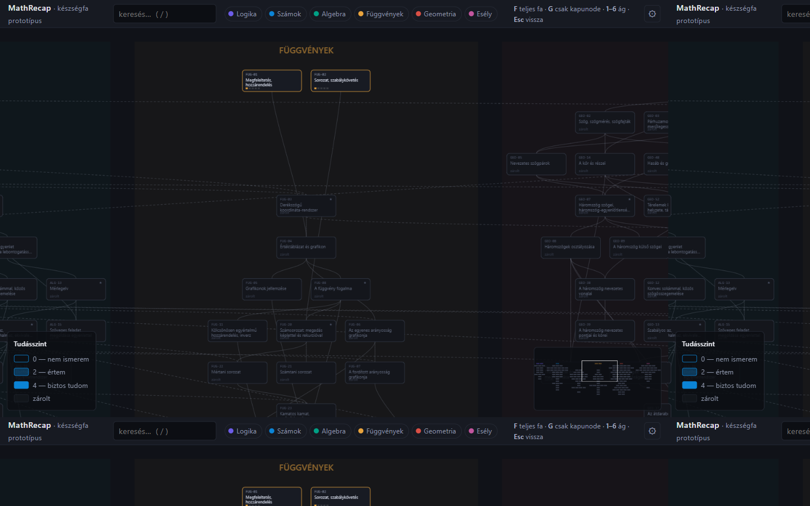
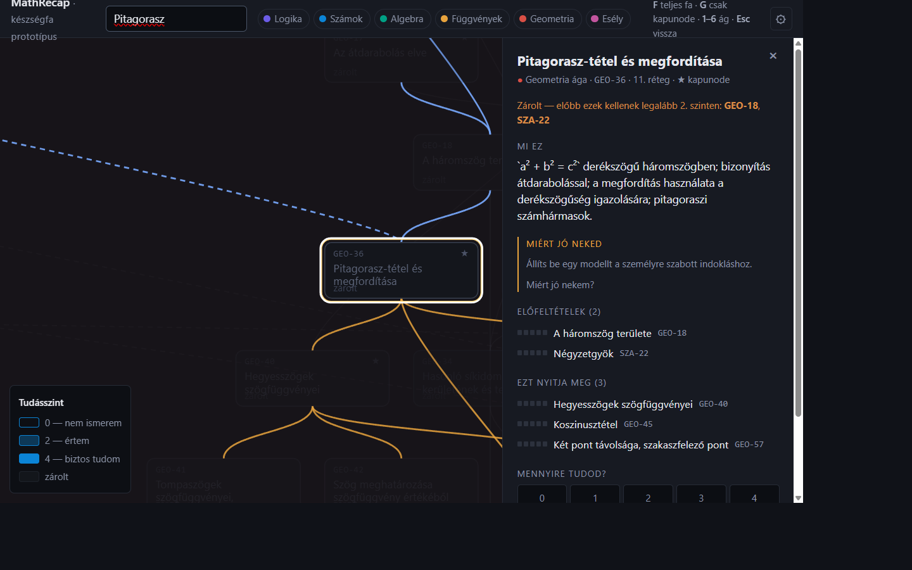
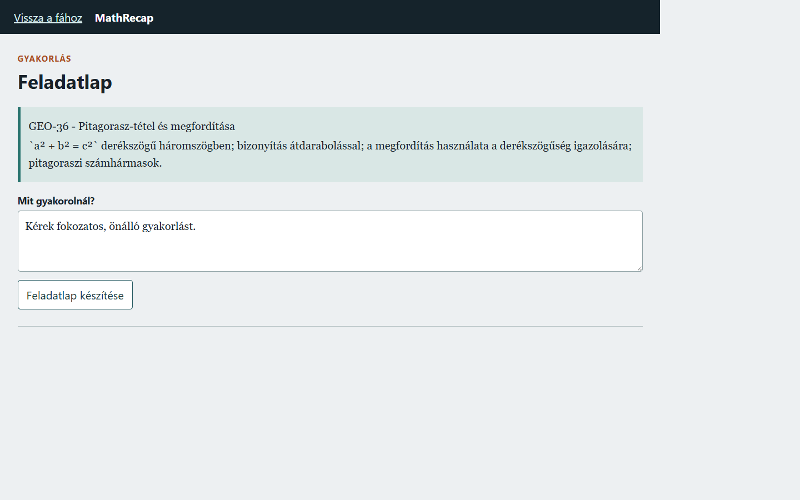
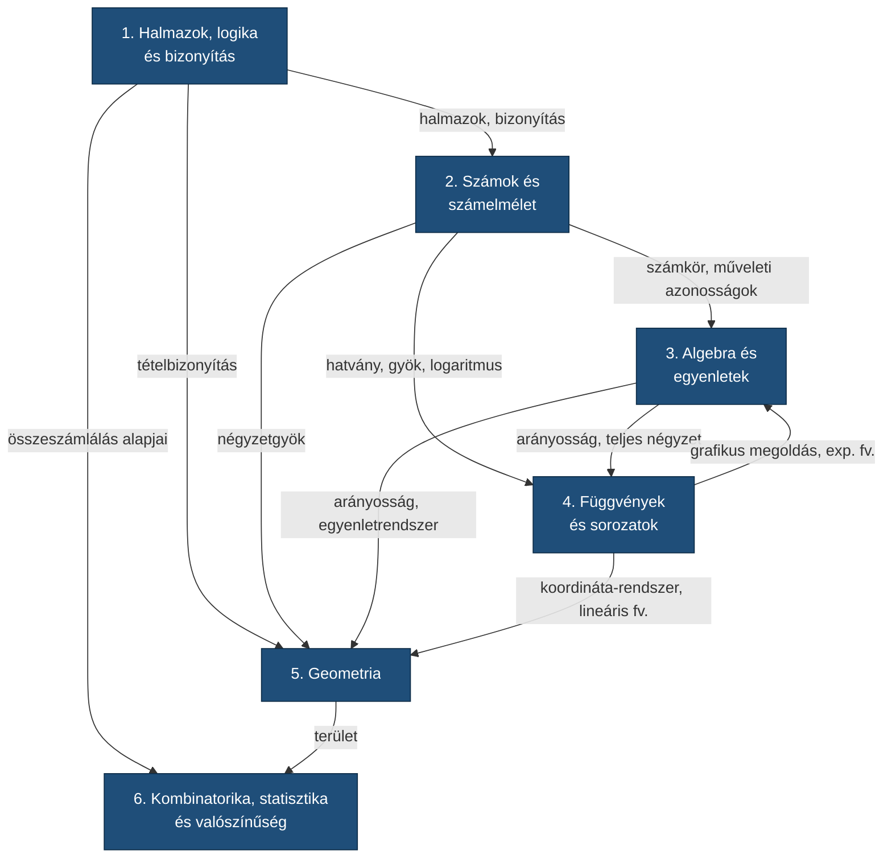
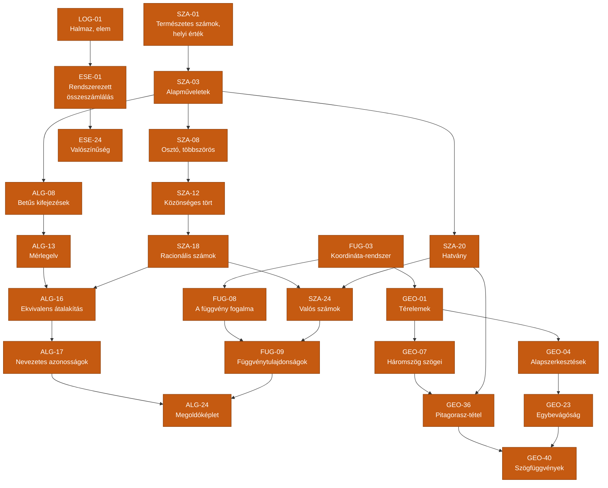

# MathRecap

MathRecap is an interactive skill tree for the Hungarian secondary-school mathematics curriculum (grades 5-12). Instead of following school years, it maps the prerequisite relationships between 190 concepts, so learners can see what they know, what is available next, and what each topic unlocks.

The interface and curriculum content are currently in Hungarian. Learners set their own mastery level, inspect prerequisites and follow-up topics, and can create printable AI-assisted practice worksheets when an OpenRouter API key is configured on the local server. Generated examples can follow the learner's stated interests, making practice more personally relevant.

**Current scope:** Learners sign in with a passwordless email code or link. Everything a learner does (mastery levels, profile and interests, the "why it is useful" texts, generated worksheets) is stored per account in a SQL Server database; the browser keeps no learner data. Learners can download all their data and delete their account. The AI model is chosen in the server configuration.

## Screenshots

<p align="center">
  
</p>

<p align="center">
  
  
</p>

## Magyar dokumentáció

# Matematika Skillfa (5–12. évfolyam)

Ez a dokumentum a magyar gimnáziumi matematika tananyagát **tech tree / skillfa** formájában rendezi
– úgy, ahogy egy RPG vagy RTS képességfája épül fel.

A fa **nem az évfolyamokat követi**, hanem a **logikai függőségeket**: egy készséget akkor lehet
"felvenni", ha az összes előfeltétele már megvan. Ezért fordulhat elő, hogy 7. osztályos és
9. osztályos anyag ugyanabba a szintbe kerül, vagy hogy egy 6. osztályos fogalom csak jóval
később válik egy 12. osztályos készség előfeltételévé.

## Helyi futtatás (Windows)

Az alkalmazás egy ASP.NET Core-kiszolgáló (`src/MathRecap.Api/`), amely a böngészős felületet (`web/`) és az API-t is kiszolgálja. Minden tanulói adat (fiók, profil, tudásszintek, indoklások, feladatlapok) fiókonként egy SQL Server-adatbázisban van; a böngésző nem tárol tanulói adatot.

### Előfeltételek

- **.NET 10 SDK** – `dotnet --version` 10-essel kezdődjön.
- **Node.js 24** (npm-mel) – a KaTeX-csomaghoz, a böngészős modulok tesztjeihez és a tantervi adatok újraépítéséhez.
- **SQL Server LocalDB** – a Visual Studio („Data storage and processing” munkaterhelés) vagy az SQL Server Express telepítője hozza; a `sqllocaldb info` parancsnak futnia kell.
- **OpenRouter API-kulcs** – csak a „Miért jó neked” szövegekhez és a feladatlapokhoz kell; a fa, a belépés, a profil és a tudásszintek nélküle is működnek.

A projekt saját LocalDB-példányt használ. Egyszer hozd létre és indítsd el:

```powershell
sqllocaldb create MathRecap -s
```

(A gépenként közös `MSSQLLocalDB` példányt sokszor egy régebbi, már nem telepített SQL Server-verzió hozta létre, és akkor nem indul; ezért kell a saját. Ha később leállt: `sqllocaldb start MathRecap`.)

### Első indítás

A repó gyökerében:

```powershell
npm ci                                   # KaTeX (a kiszolgáló a node_modules/katex/dist mappából adja)
dotnet tool restore                      # dotnet-ef (dotnet-tools.json), a migrációkhoz
$env:OPENROUTER_API_KEY = "sajat-openrouter-kulcs"
dotnet run --project src/MathRecap.Api
```

Az API-kulcs így csak az adott PowerShell-ablakra érvényes. Tartósan a felhasználói környezeti változók közé teheted: `[Environment]::SetEnvironmentVariable("OPENROUTER_API_KEY", "sajat-openrouter-kulcs", "User")` (utána nyiss új ablakot). A kulcsot ne írd be a repó egyik fájljába se.

A `dotnet run` Development környezetben indul (`src/MathRecap.Api/Properties/launchSettings.json`), a címe `http://localhost:3000`. Developmentben a kiszolgáló induláskor létrehozza a `(localdb)\MathRecap` példány `MathRecap` adatbázisát, illetve a legfrissebb migrációra hozza.

### Belépés helyben

Jelszó nincs. A belépési oldalon (`/sign-in.html`) a tanuló megadja az e-mail-címét, és kap egy levelet egy 6 jegyű kóddal és egy belépési linkkel; bármelyikkel beléphet. Mindkettő 10 percig érvényes és egyszer használható; új kód kérése a korábbit érvényteleníti, öt hibás kód után új kódot kell kérni. Az első sikeres belépés hozza létre a fiókot. A link egy megerősítő oldalra visz, ahol a **Belépés** gombbal lehet belépni (a link megnyitása önmagában nem léptet be, így a levelezők linkellenőrzése nem használhatja el). A munkamenet 30 napig él, használat közben megújul. Az oldalak (fa, feladatlap, átnézés) munkamenet nélkül a belépési oldalra irányítanak, majd belépés után vissza.

Valódi levélküldő még nincs, ezért helyben két fejlesztői eszköz pótolja (csak Developmentben kapcsolhatók be):

- **Fejlesztői fiókok:** a belépési oldal „Fejlesztői belépés (csak helyi teszteléshez)” részében egy kattintással lehet belépni: `tanulo1@mathrecap.local`, `tanulo2@mathrecap.local` és `admin@mathrecap.local` (ez utóbbi adminisztrátor).
- **Fejlesztői postafiók:** az alkalmazás nem küld levelet, hanem megőrzi az utolsó 50-et. A `http://localhost:3000/dev/outbox.html` oldalon olvasható a kód és a kattintható belépési link (JSON-ban: `/api/dev/outbox`). Bármilyen címmel kipróbálható az új tanuló regisztrációja, például `valaki@example.test`.

### Tesztek

```powershell
dotnet build                             # a figyelmeztetések is hibák (Directory.Build.props)
dotnet test                              # a kiszolgáló tesztjei (hamis OpenRouterrel, hálózat nélkül)
npm test                                 # a böngészős modulok tesztjei (Node beépített tesztfuttatójával)
```

A `dotnet test` futásonként saját, `MathRecapTests_<guid>` nevű LocalDB-adatbázist hoz létre a migrációkkal, és a végén törli; ehhez a `MathRecap` példánynak futnia kell. A tesztek a valódi API-kulcsot nem használják. Hasznos még: `npm run build:data` (a tantervi adatok, `web/data/curriculum.json` újraépítése és ellenőrzése).

Könyvtárszerkezet: `web/` – a böngészőnek kiszolgált front end; `src/MathRecap.Api/` – az ASP.NET Core-kiszolgáló; `tests/` – a .NET- és a JS-tesztek, valamint közös tesztesetek; `tools/` – az adatgenerátor; `agak/` – a tanterv forrása; `docs/` – tervek és leírások.

### Adatbázis és migrációk

Developmenten kívül az alkalmazás nem migrál; ott indítás előtt kell lefuttatni:

```powershell
dotnet ef database update --project src/MathRecap.Api --connection "<kapcsolati sztring>"
```

Új migráció: `dotnet ef migrations add <Név> --project src/MathRecap.Api --output-dir Data/Migrations`.

### Beállítások

A beállítások a `src/MathRecap.Api/appsettings.json` (minden környezet), az `appsettings.Development.json` (csak Development), a környezeti változók (a `:` helyett `__`, például `OpenRouter__Model`) és a parancssor rétegeiből állnak össze. Az `appsettings.json` szándékosan nem tartalmaz titkot, kapcsolati sztringet, adminisztrátort, és a fejlesztői eszközök benne ki vannak kapcsolva (ezt teszt is ellenőrzi).

| Kulcs | Jelentés | Development | Éles környezetben |
|---|---|---|---|
| `ASPNETCORE_ENVIRONMENT` | a környezet neve | `Development` (launchSettings.json) | `Production`; Developmenten kívül HTTPS-átirányítás és HSTS van |
| `ConnectionStrings:Database` | az SQL Server-adatbázis | `(localdb)\MathRecap`, `MathRecap` adatbázis | **kötelező**; titokként kezelendő |
| `App:BaseUrl` | az alkalmazás böngészőből elérhető címe; erre mutatnak a levelek linkjei | `http://localhost:3000` | **kötelező**, `https://` cím |
| `SignIn:CodeHashKey` | a tárolt belépési kódok HMAC-kulcsa, legalább 32 karakter | nem titkos fejlesztői érték | **kötelező**, véletlen titok; nélküle nem indul |
| `Admin:Emails` | az adminisztrátorok e-mail-címei (illusztrációk átnézése) | `admin@mathrecap.local` | a valódi adminisztrátorok (alapból üres) |
| `OPENROUTER_API_KEY` vagy `OpenRouter:ApiKey` | az OpenRouter API-kulcsa | környezeti változóból | titokként (pl. Key Vault); nélküle az AI-funkciók 503-at adnak |
| `OpenRouter:Model` | a használt modell | `openai/gpt-6-luna` | igény szerint |
| `OpenRouter:BaseUrl`, `OpenRouter:Timeout` | az OpenRouter címe és a kérésenkénti időkorlát | `https://openrouter.ai/api/v1`, 2 perc | változatlanul |
| `RateLimits:SignInPerMinute`, `SignInPerHour` | belépési levélkérések IP-címenként | 5/perc, 30/óra | lásd „Közzététel előtt” (valódi kliens-IP) |
| `RateLimits:VerifyPerMinute` | kód- és linkellenőrzések IP-címenként | 20/perc | |
| `RateLimits:SignInPerEmailPerHour` | belépési levelek címenként | 5/óra | |
| `DevOutbox:Enabled` | fejlesztői postafiók | be | **ki**; bekapcsolva az alkalmazás nem indul |
| `DevAccounts:Enabled`, `DevAccounts:Accounts` | egykattintásos fejlesztői fiókok | be, három fiók | **ki**; bekapcsolva az alkalmazás nem indul |
| (levélküldő) | valódi e-mail-küldés | a fejlesztői postafiók pótolja | **kötelező, de még nincs megírva**: nélküle Developmenten kívül az alkalmazás nem indul („No email sender is configured”) |
| `StaticHosting:WebRoot`, `KatexRoot` | a front end és a KaTeX mappája | `../../web`, `../../node_modules/katex/dist` | a közzétett csomagban `web`, `vendor/katex` (a csproj bemásolja) |
| `AllowedHosts` | elfogadott `Host` fejlécek | `localhost;127.0.0.1;[::1]` | az éles domain |
| `https_port` / `HTTPS_PORTS` | a HTTPS-átirányítás célportja | – | ha a kiszolgáló nem tudja magától (proxy mögött) |
| `Logging:LogLevel` | naplózási szintek | Information, `Microsoft.AspNetCore`: Warning | változatlanul |

### Feladatlap és nyomtatás

Egy készség paneljének **Gyakorlás** gombja külön feladatlap-oldalt nyit. Egyetlen szabad szöveges kérésben lehet megadni a gyakorlás fókuszát; a generált példák a tanuló megadott érdeklődési köreihez is igazodhatnak. Az **Új feladatlap** új generálást indít, nem fűzi hozzá a korábbihoz. A **Feladatlap** és **Megoldókulcs** külön nézet, mindkettőnek saját nyomtatás gombja van; a nyomtatási stílus elrejti az alkalmazás vezérlőit. A feladatmegoldás nem módosítja automatikusan a tudásszintet.

Minden elkészült feladatlap a tanuló fiókjába mentődik. A feladatlap-oldal **Korábbi feladatlapjaid** listája az adott készség mentett lapjait mutatja (cím, dátum, kérés, a legújabb elöl); egy lap megnyitható (`worksheet.html?skill=<készség>&worksheet=<azonosító>`, újratöltés után is), ugyanúgy nyomtatható, és megerősítés után törölhető.

### Adatok, fiók és átnézés

A kiszolgáló fiókonként tárolja a profilt, az onboarding befejezését, a tudásszinteket (csak a 0-nál nagyobbakat), a „Miért jó neked” szövegeket (készségenként a legutóbbit, azzal a profillal együtt, amelyhez készült) és a feladatlapokat. A panel megnyitásakor a fa a tárolt szöveget olvassa be (`GET /api/usefulness/{skillId}`, modellhívás nélkül), ha az a jelenlegi profilhoz készült; új szöveg csak kérésre készül. Egy tanuló más tanuló adatát nem látja és nem módosíthatja; más feladatlapjára a válasz „nem található”. A korábbi verziók böngészőben tárolt adatait (`mathrecap.local-state`, `mathrecap.illustrationReview.v1`) az alkalmazás nem veszi át, csak törli.

A fejléc fiókmenüjében (a belépett cím) van az **Adataim letöltése** (minden tanulói adat egy JSON-fájlban, `mathrecap-adataim-<dátum>.json`), a **Fiók törlése** (megerősítés után a fiókot és minden hozzá tartozó adatot töröl, a belépési kódokat is, és minden munkamenetét lezárja), a **Kijelentkezés**, adminisztrátoroknak az **Átnézés**, valamint az adatvédelmi tájékoztató és a felhasználási feltételek.

Az illusztrációk átnézése (`review.html`) az adminisztrátoroké: azoké a belépett felhasználóké, akiknek a címe szerepel az `Admin:Emails` listában. Az átnézés állapota közös, a kiszolgálón van. Más felhasználónak az oldal „nincs hozzáférés” oldalt (403), az API 403-at ad.

### Adatvédelmi tájékoztató és felhasználási feltételek

A `web/privacy.html` („Adatvédelmi tájékoztató”) és a `web/terms.html` („Felhasználási feltételek”) nyilvános oldal, a belépési oldalról és a fiókmenüből érhető el; a profilmezők és a feladatlap-kérés mellett rövid figyelmeztetés kéri, hogy a tanuló ne írjon be személyes adatot. A szöveg tizenéveseknek szól, és csak azt állítja, amit az alkalmazás ténylegesen tesz.

**Az üzemeltető nevét és elérhetőségét még ki kell tölteni:** egyetlen helyen szerepel, a `web/privacy.html` „Ki kezeli az adataidat?” részében, `[Üzemeltető neve és elérhetősége]` helyőrzőként (a feltételek erre hivatkoznak). Közzététel előtt a tulajdonosnak ki kell töltenie, és mindkét szöveget jogásszal át kell nézetnie.

### Biztonsági határ

- **Hozzáférés:** minden API-végpont munkamenetet kér, kivéve a belépés végpontjait, a fejlesztői eszközöket és az ismeretlen API-útvonalak JSON-404-ét; az `/api/admin/*` végpontok adminisztrátort is. Minden HTML-oldal munkamenetet kér, kivéve a `PageAccess` nyilvános listáján szereplőket (belépés, belépés linkkel, adatvédelem, feltételek, fejlesztői postafiók). Az `EndpointAccessTests` minden végpontot és minden `web/**/*.html` oldalt végigjár: ha új végpont vagy oldal kerül be anélkül, hogy eldöntöttük volna a hozzáférését, a teszt elbukik.
- **Fejlécek** (`SecurityHeaders.cs`, minden válaszon): `Content-Security-Policy: default-src 'self'; script-src 'self'; style-src 'self'; img-src 'self' data:; font-src 'self'; connect-src 'self'; object-src 'none'; base-uri 'self'; form-action 'self'; frame-ancestors 'none'`, `X-Content-Type-Options: nosniff`, `X-Frame-Options: DENY`, `Referrer-Policy: no-referrer`, szigorú `Permissions-Policy`, `Cross-Origin-Opener-Policy: same-origin`; az API válaszain `Cache-Control: no-store`. Developmenten kívül HTTPS-átirányítás és HSTS. Az oldalakon ezért nincs beágyazott szkript, `<style>` elem, `style="…"` attribútum és `on…=` eseménykezelő: a stílusokat a szkriptek az `element.style`-on keresztül állítják (ezt a CSP engedi). A `tests/web/content-security.test.mjs` a forrásban ellenőrzi ezt.
- **Munkamenet:** a süti HttpOnly és SameSite=Lax, HTTPS-en Secure is; az API minden módosító kérése (POST, PUT, PATCH, DELETE) csak akkor fut le, ha az `Origin` fejléc az alkalmazás saját címe.
- **Belépési titkok:** a kódokból és linkekből csak hash kerül az adatbázisba (a kódból kulcsolt HMAC-SHA256, a linkből SHA-256).
- **Naplók:** semmilyen szinten (a Debugot is beleértve) nem kerül a naplóba e-mail-cím, kód, link, profilszöveg, feladatlap-kérés, prompt, modellválasz vagy API-kulcs, csak felhasználói azonosítók és technikai események; a `LoggingTests` egy teljes tanulói munkamenettel ellenőrzi.
- **AI:** az OpenRouter API-kulcsa kizárólag a kiszolgálón marad; a böngészőnek nem adódik át, a hibaüzenetek sem tartalmazzák. A modellnek küldött profil- és szabad szöveges kérés elhatárolt, nem megbízható adatként szerepel. A kiszolgáló a modell válaszát a `src/MathRecap.Api/Ai/Schemas/` JSON-sémái és további szabályok szerint ellenőrzi, érvénytelen feladatlapnál egyszer javítást kér, a felület pedig nem szúr be modell-szöveget HTML-ként.

### Közzététel előtt

A helyi béta kész; nyilvános indulás előtt ezek hiányoznak:

1. **Valódi levélküldő** (például egy e-mail-szolgáltató API-ja) `IEmailSender`-ként; amíg nincs, az alkalmazás Developmenten kívül el sem indul.
2. **Visszaélés elleni korlátok az AI-hívásokra:** felhasználónkénti napi/órai kvóta a feladatlapokra és az indoklásokra (most csak a belépés korlátozott), és költségkeret az OpenRouter-fiókon.
3. **Szülői hozzájárulás 16 év alatt:** a tájékoztató szerint kell, de az alkalmazás még nem kéri és nem kezeli (életkor-nyilatkozat, szülői megerősítés).
4. **Jogi átnézés:** az adatvédelmi tájékoztató és a felhasználási feltételek szövege, az üzemeltető adatainak kitöltése, az adatkezelés jogalapja, az OpenRouterrel és a modellszolgáltatókkal kötött feltételek (EU-n kívüli adattovábbítás), a biztonsági mentések megőrzési ideje.
5. **Data Protection-kulcsok tárolása:** a munkamenet-sütit az ASP.NET Core Data Protection titkosítja; a kulcsokat tartósan és közösen kell tárolni (pl. Azure Blob Storage + Key Vault), különben újraindításkor vagy több példány esetén minden munkamenet elvész.
6. **Továbbított fejlécek proxy mögött:** a `ForwardedHeaders` middleware beállítása, hogy a sebességkorlát a valódi kliens-IP-t lássa (most a proxy címét látná, és mindenki egy kosárba kerülne), a HTTPS-átirányítás és a Secure süti pedig a valódi sémát.
7. **Azure-telepítés:** App Service és Azure SQL (vagy hasonló), titkok Key Vaultban, `dotnet ef database update` a telepítés részeként, `AllowedHosts` és `App:BaseUrl` az éles domainre, naplók megőrzési ideje.

## Hatókör

- **Célcsoport:** gimnáziumi tanuló, 5–12. évfolyam
- **Szint:** középszintű érettségi (a 2020-as NAT és a hozzá illeszkedő kerettantervek alapján)
- **Csomópontok száma:** 190 (281 él, ebből 35 ágak közötti; a leghosszabb tanulási út 15 lépés)
- **Nyelv:** magyar

Az interaktív változat felhasználói felületének terve: [docs/ux-terv.md](docs/ux-terv.md).

## Az ágak

| # | Ág | Kód | Csomópont | Fájl |
|---|----|-----|-----------|------|
| 1 | **Halmazok, logika és bizonyítás** – „a Gondolkodás ága" | `LOG` | 16 | [agak/01-halmazok-logika.md](agak/01-halmazok-logika.md) |
| 2 | **Számok és számelmélet** – „a Számok ága" | `SZA` | 33 | [agak/02-szamok-szamelmelet.md](agak/02-szamok-szamelmelet.md) |
| 3 | **Algebra és egyenletek** – „az Absztrakció ága" | `ALG` | 28 | [agak/03-algebra-egyenletek.md](agak/03-algebra-egyenletek.md) |
| 4 | **Függvények és sorozatok** – „a Változás ága" | `FUG` | 23 | [agak/04-fuggvenyek-sorozatok.md](agak/04-fuggvenyek-sorozatok.md) |
| 5 | **Geometria** – „a Tér ága" | `GEO` | 61 | [agak/05-geometria.md](agak/05-geometria.md) |
| 6 | **Kombinatorika, statisztika és valószínűség** – „az Esély ága" | `ESE` | 29 | [agak/06-kombinatorika-statisztika-valoszinuseg.md](agak/06-kombinatorika-statisztika-valoszinuseg.md) |

## Jelmagyarázat

- **ID** – a készség egyedi azonosítója (`ÁG-sorszám`), erre hivatkoznak az előfeltételek.
- **Szint** – a fában elfoglalt mélység. Egy szint minden csomópontja párhuzamosan tanulható,
  ha az előfeltételei megvannak. A szint **nem évfolyam**.
- **Előfeltétel** – azok a készségek, amelyek nélkül a csomópont nem érthető meg.
  A más ágból érkező előfeltételeket a gráfok **szaggatott vonallal** és halvány kitöltéssel jelölik.
- **Kapunode** (⭐) – olyan csomópont, amelyre sok másik épül; ha itt elakadsz, sok minden beomlik utána.

## Az ágak közötti kapcsolatok


```mermaid
graph TD
    LOG["1. Halmazok, logika<br/>és bizonyítás"]
    SZA["2. Számok és<br/>számelmélet"]
    ALG["3. Algebra és<br/>egyenletek"]
    FUG["4. Függvények<br/>és sorozatok"]
    GEO["5. Geometria"]
    ESE["6. Kombinatorika, statisztika<br/>és valószínűség"]

    LOG -->|"halmazok, bizonyítás"| SZA
    LOG -->|"összeszámlálás alapjai"| ESE
    LOG -->|"tételbizonyítás"| GEO
    SZA -->|"számkör, műveleti azonosságok"| ALG
    SZA -->|"hatvány, gyök, logaritmus"| FUG
    SZA -->|"négyzetgyök"| GEO
    ALG -->|"arányosság, teljes négyzet"| FUG
    ALG -->|"arányosság, egyenletrendszer"| GEO
    FUG -->|"koordináta-rendszer, lineáris fv."| GEO
    FUG -->|"grafikus megoldás, exp. fv."| ALG
    GEO -->|"terület"| ESE

    classDef ag fill:#1f4e79,stroke:#0d2c47,color:#fff;
    class LOG,SZA,ALG,FUG,GEO,ESE ag;
```

## A fa gerince — a legfontosabb kapunode-ok

Ez a "fő ösvény": ha ezek megvannak, a fa nagy része elérhetővé válik.


```mermaid
graph TD
    SZA01["SZA-01<br/>Természetes számok,<br/>helyi érték"]
    SZA03["SZA-03<br/>Alapműveletek"]
    SZA08["SZA-08<br/>Osztó, többszörös"]
    SZA12["SZA-12<br/>Közönséges tört"]
    SZA18["SZA-18<br/>Racionális számok"]
    SZA24["SZA-24<br/>Valós számok"]
    SZA20["SZA-20<br/>Hatvány"]

    ALG08["ALG-08<br/>Betűs kifejezések"]
    ALG13["ALG-13<br/>Mérlegelv"]
    ALG16["ALG-16<br/>Ekvivalens átalakítás"]
    ALG17["ALG-17<br/>Nevezetes azonosságok"]
    ALG24["ALG-24<br/>Megoldóképlet"]

    FUG03["FUG-03<br/>Koordináta-rendszer"]
    FUG08["FUG-08<br/>A függvény fogalma"]
    FUG09["FUG-09<br/>Függvénytulajdonságok"]

    GEO01["GEO-01<br/>Térelemek"]
    GEO04["GEO-04<br/>Alapszerkesztések"]
    GEO07["GEO-07<br/>Háromszög szögei"]
    GEO23["GEO-23<br/>Egybevágóság"]
    GEO36["GEO-36<br/>Pitagorasz-tétel"]
    GEO40["GEO-40<br/>Szögfüggvények"]

    LOG01["LOG-01<br/>Halmaz, elem"]
    ESE01["ESE-01<br/>Rendszerezett<br/>összeszámlálás"]
    ESE24["ESE-24<br/>Valószínűség"]

    SZA01 --> SZA03 --> SZA08 --> SZA12 --> SZA18 --> SZA24
    SZA03 --> SZA20 --> SZA24
    SZA03 --> ALG08 --> ALG13 --> ALG16 --> ALG17 --> ALG24
    SZA18 --> ALG16
    FUG03 --> FUG08 --> FUG09
    SZA24 --> FUG09
    FUG09 --> ALG24
    LOG01 --> ESE01 --> ESE24
    GEO01 --> GEO04 --> GEO23
    GEO01 --> GEO07 --> GEO36
    SZA20 --> GEO36 --> GEO40
    GEO23 --> GEO40
    FUG03 --> GEO01

    classDef gerinc fill:#c55a11,stroke:#843c0c,color:#fff;
    class SZA01,SZA03,SZA08,SZA12,SZA18,SZA24,SZA20,ALG08,ALG13,ALG16,ALG17,ALG24,FUG03,FUG08,FUG09,GEO01,GEO04,GEO07,GEO23,GEO36,GEO40,LOG01,ESE01,ESE24 gerinc;
```

## Ajánlott „build order"-ek

Több érvényes sorrend létezik. Néhány tipikus haladási stratégia:

### 1. „Kiegyensúlyozott" (a kerettanterv alapértelmezett útja)
Minden ágon párhuzamosan haladsz, spirálisan visszatérve.
`SZA` → `LOG`/`ESE` → `ALG` → `GEO` → `FUG`, majd újra elölről magasabb szinten.

### 2. „Algebra rush" (érettségi-orientált)
A számolási készség kiépítése után egyenesen az egyenletmegoldásra fókuszálsz:
`SZA-01…SZA-19` → `ALG-08…ALG-16` → `ALG-17…ALG-24` → `FUG-08…FUG-12`.
Ezzel a középszintű érettségi feladatsorának kb. felét lefeded.

### 3. „Geometria fókusz"
`GEO-01…GEO-14` (alakzatok) → `GEO-15…GEO-22` (mérés) → `GEO-23…GEO-35` (transzformációk)
→ `GEO-36…GEO-45` (nevezetes tételek, trigonometria) → `GEO-46…GEO-61` (tér- és koordinátageometria).
Vigyázat: a `GEO-36` (Pitagorasz) előfeltétele az `SZA-22` (négyzetgyök), a `GEO-40`
(szögfüggvények) pedig hasonlóságot igényel.

### 4. „Adat és esély"
`ESE-12…ESE-16` (leíró statisztika) → `ESE-01…ESE-06` (kombinatorika)
→ `ESE-21…ESE-29` (valószínűség). Viszonylag függetlenül tanulható a többi ágtól.

## Hogyan használd

1. Válaszd ki a célkészséget (pl. `ALG-24` – megoldóképlet).
2. Kövesd visszafelé az előfeltételeket, amíg olyan csomóponthoz nem érsz, amit már tudsz.
3. Onnan haladj előre. A szintek megmutatják, mi tanulható párhuzamosan.

## Forrás

A tartalom a 2020-as Nemzeti alaptanterv és a hozzá illeszkedő kerettantervek matematika
tananyagából származik:

- [Kerettanterv az általános iskola 5–8. évfolyama számára – Matematika](https://www.oktatas.hu/pub_bin/dload/kozoktatas/kerettanterv/Matematika_F.docx)
- [Kerettanterv a gimnáziumok 9–12. évfolyama számára – Matematika](https://www.oktatas.hu/pub_bin/dload/kozoktatas/kerettanterv/Matematika_K.docx)
- [5/2020. (I. 31.) Korm. rendelet – Nemzeti alaptanterv](https://njt.hu/jogszabaly/2020-5-20-22.0)

A csomópontokra bontás, a szintezés és a függőségi élek szerkesztői döntések: a kerettanterv
témaköreit és fogalomjegyzékeit bontják tanulási sorrendbe.
