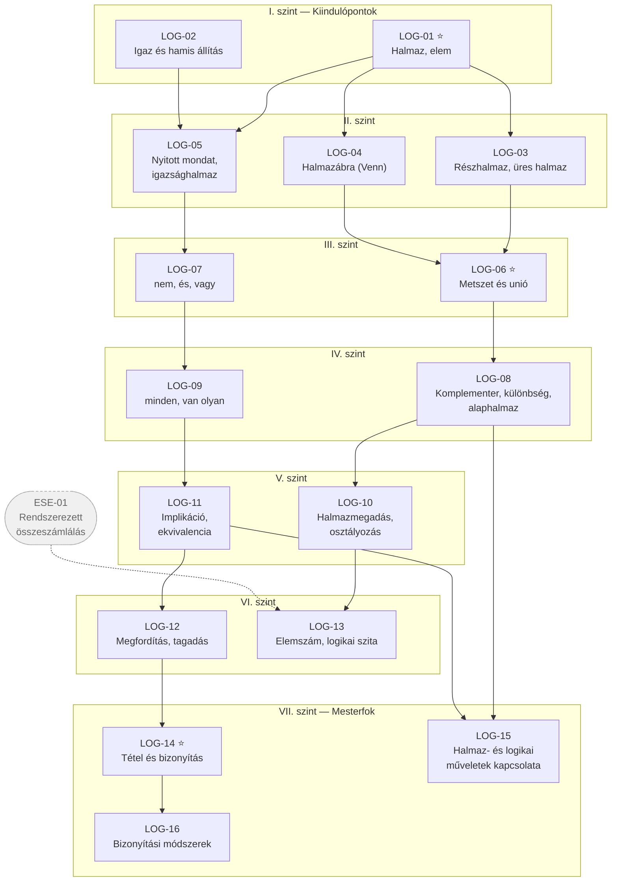

# 1. ág — Halmazok, logika és bizonyítás

> „A Gondolkodás ága" · kód: `LOG` · 16 csomópont

Ez a legrövidebb, de a legmélyebbre ható ág. Nem önmagában értékes: a halmazszemlélet és a
logikai pontosság az összes többi ág **nyelvezetét** adja. A `LOG-14` (tétel és bizonyítás)
az a pont, ahonnan a matematika „iskolai számolásból" deduktív tudománnyá válik.

## Függőségi gráf

## Csomópontok

### I. szint

| ID | Készség | Leírás | Előfeltétel |
|----|---------|--------|-------------|
| **LOG-01** ⭐ | Halmaz, elem, halmazba rendezés | Elemek válogatása egy vagy több tulajdonság szerint; annak felismerése, hogy egy halmazt a tagjai határoznak meg. A „hova tartozik?" kérdés matematikai formája. | — |
| **LOG-02** | Igaz és hamis állítás | Egy kijelentés logikai értékének megállapítása; igaz és hamis állítások önálló megfogalmazása, cáfolat ellenpéldával. | — |

### II. szint

| ID | Készség | Leírás | Előfeltétel |
|----|---------|--------|-------------|
| **LOG-03** | Részhalmaz, üres halmaz, halmazok egyenlősége | A „minden eleme egyben eleme a másiknak" viszony; valódi részhalmaz, üres halmaz, két halmaz egyenlőségének feltétele. | LOG-01 |
| **LOG-04** | Halmazábra (Venn-diagram) | Halmazok és viszonyaik vizuális ábrázolása; az ábra olvasása és készítése. A későbbi halmazműveletek szemléleti alapja. | LOG-01 |
| **LOG-05** | Nyitott mondat, igazsághalmaz | Változót tartalmazó állítás; azon behelyettesítések halmaza, amelyek igazzá teszik. Az egyenlet fogalmának logikai előképe. | LOG-01, LOG-02 |

### III. szint

| ID | Készség | Leírás | Előfeltétel |
|----|---------|--------|-------------|
| **LOG-06** ⭐ | Metszet és unió | Két halmaz közös részének és egyesítésének képzése, ábrázolása, elemeinek felsorolása. | LOG-03, LOG-04 |
| **LOG-07** | Logikai műveletek: „nem", „és", „vagy" | A tagadás, a konjunkció, valamint a megengedő és a kizáró „vagy" jelentése és helyes használata. | LOG-05 |

### IV. szint

| ID | Készség | Leírás | Előfeltétel |
|----|---------|--------|-------------|
| **LOG-08** | Komplementer, különbség, alaphalmaz | Kiegészítő halmaz képzése adott alaphalmazra nézve; két halmaz különbsége. Annak megértése, hogy a komplementer csak alaphalmazzal együtt értelmes. | LOG-06 |
| **LOG-09** | Kvantorok: „minden", „van olyan" | Univerzális és egzisztenciális állítások megkülönböztetése, logikai értékük eldöntése és indoklása. | LOG-07 |

### V. szint

| ID | Készség | Leírás | Előfeltétel |
|----|---------|--------|-------------|
| **LOG-10** | Halmazmegadási módok, diszjunkt felbontás, osztályozás | Halmaz megadása elemek felsorolásával és tulajdonsággal; halmaz felbontása közös elem nélküli részhalmazokra; osztályozás mint modellezési eszköz. | LOG-08 |
| **LOG-11** | Implikáció és ekvivalencia | A „ha…, akkor…" és az „akkor és csak akkor" típusú állítások jelentése, logikai értéke; a szükséges és az elégséges feltétel megkülönböztetése. | LOG-09 |

### VI. szint

| ID | Készség | Leírás | Előfeltétel |
|----|---------|--------|-------------|
| **LOG-12** | Állítás megfordítása és tagadása | Adott implikáció megfordításának megfogalmazása, és annak felismerése, hogy a megfordítás nem feltétlenül igaz; összetett állítások tagadása. | LOG-11 |
| **LOG-13** | Halmaz elemszáma, logikai szita | Véges halmazok elemszámának meghatározása; két-három halmaz uniójának elemszáma a szita-formulával. | LOG-10, *ESE-01* |

### VII. szint

| ID | Készség | Leírás | Előfeltétel |
|----|---------|--------|-------------|
| **LOG-14** ⭐ | Tétel és bizonyítás | A matematikai bizonyítás fogalma: definíció, tétel, bizonyítás elkülönítése. Néhány lépéses bizonyítási gondolatsor megértése és önálló összeállítása. | LOG-12 |
| **LOG-15** | Halmazműveletek és logikai műveletek kapcsolata | Annak felismerése, hogy a metszet ↔ „és", az unió ↔ „vagy", a komplementer ↔ „nem" megfeleltetés strukturális; igazságtáblázat használata. | LOG-08, LOG-11 |
| **LOG-16** | Bizonyítási módszerek | Direkt bizonyítás, indirekt bizonyítás, esetszétválasztás, ellenpélda. A stratégia tudatos megválasztása az állítás szerkezete alapján. | LOG-14 |

## Kapcsolódás a többi ághoz

| Innen indul | Ide vezet | Miért |
|---|---|---|
| LOG-01 | ESE-01 | Az összeszámlálás mindig egy halmaz elemeinek számbavétele. |
| LOG-06 | ESE-23 | Az eseménytér és az események halmazműveletekkel épülnek. |
| LOG-05 | ALG-16 | Az alaphalmaz–megoldáshalmaz páros a nyitott mondat fogalmán nyugszik. |
| LOG-14 | GEO-37, GEO-36 | A Pitagorasz- és Thalész-tétel az első „igazi" bizonyítások. |
| LOG-16 | SZA-24 | A √2 irracionalitása klasszikus indirekt bizonyítás. |
