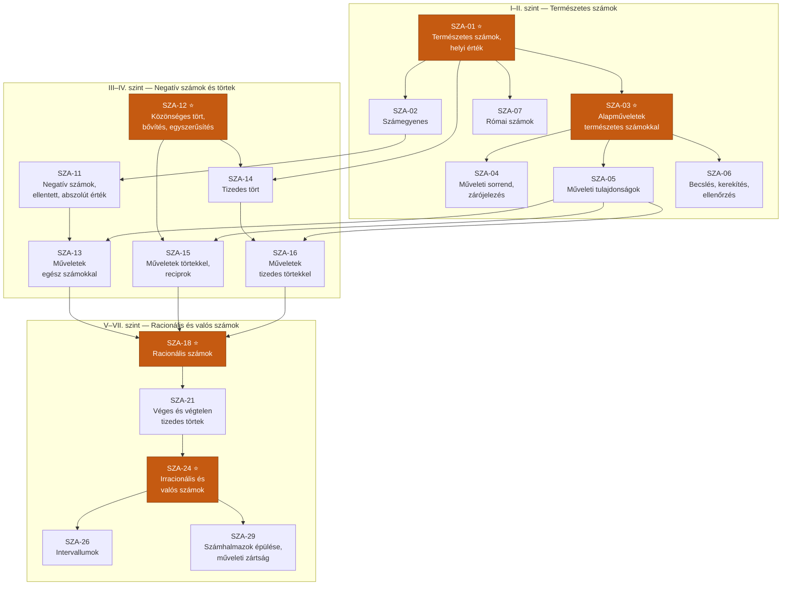
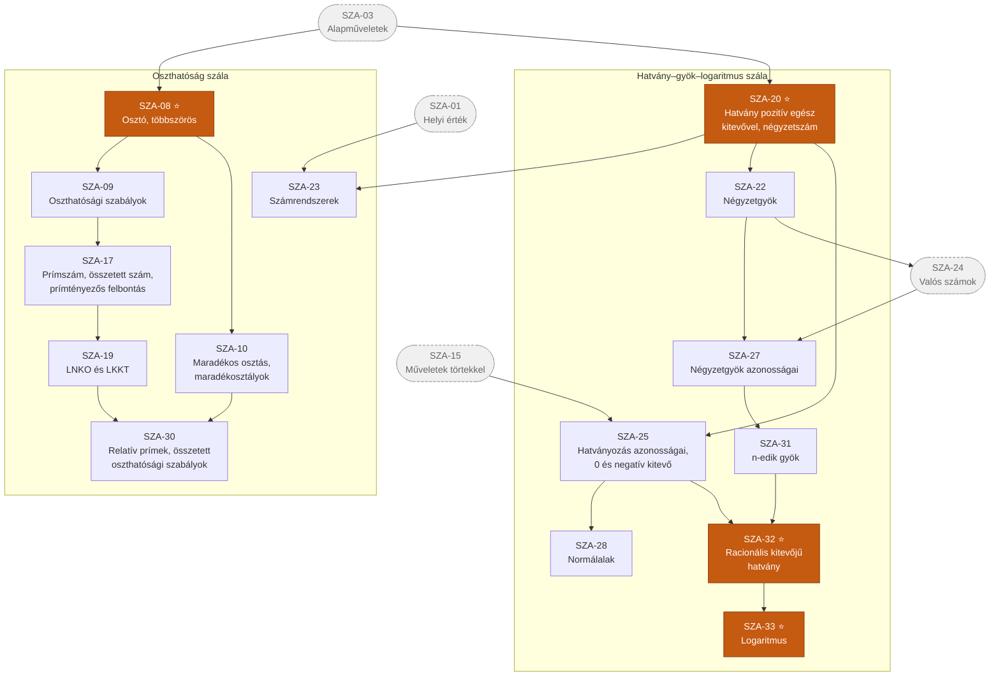

# 2. ág — Számok és számelmélet

> „A Számok ága" · kód: `SZA` · 33 csomópont

A leghosszabb, legmélyebb ág: a természetes számoktól a logaritmusig tart. Két nagy szála van,
amelyek végig párhuzamosan futnak, majd a valós számoknál egyesülnek:

- **számkörbővítés**: természetes → egész → racionális → valós
- **műveletbővítés**: alapműveletek → hatvány → gyök → logaritmus

Ez az ág táplálja az `ALG` és a `FUG` ágat, és nélküle a `GEO` ág mérési része sem működik.

## Függőségi gráf — számkörbővítés

## Függőségi gráf — oszthatóság és hatványozás

## Csomópontok

### I. szint — A számfogalom alapja

| ID | Készség | Leírás | Előfeltétel |
|----|---------|--------|-------------|
| **SZA-01** ⭐ | Természetes számok, helyi érték | Helyi érték, alaki érték, valódi érték; nagy számok írása és olvasása. Annak megértése, hogy a számjegy helye hordozza az információt. | — |

### II. szint

| ID | Készség | Leírás | Előfeltétel |
|----|---------|--------|-------------|
| **SZA-02** | Számegyenes | Számok ábrázolása egyenesen, összehasonlítás, sorba rendezés. A szám mint pozíció – a későbbi koordináta-rendszer és a valós számok egyenes-modelljének alapja. | SZA-01 |
| **SZA-03** ⭐ | Alapműveletek természetes számokkal | Írásbeli összeadás, kivonás, szorzás és osztás algoritmusai; fejszámolás; a hányados becslése. | SZA-01 |
| **SZA-07** | Római számok | Az I, V, X, L, C, D, M jelek ismerete, számok írása és olvasása. Példa nem helyiértékes számírásra. | SZA-01 |

### III. szint

| ID | Készség | Leírás | Előfeltétel |
|----|---------|--------|-------------|
| **SZA-04** | Műveleti sorrend és zárójelezés | A műveletek elvégzési sorrendje; a zárójel mint felülíró jel. Fejben, írásban és számológéppel egyaránt. | SZA-03 |
| **SZA-05** | Műveleti tulajdonságok | Felcserélhetőség (kommutativitás), csoportosíthatóság (asszociativitás), széttagolhatóság (disztributivitás) és tudatos alkalmazásuk a számolás egyszerűsítésére. | SZA-03 |
| **SZA-06** | Becslés, kerekítés, ellenőrzés | Nagyságrendi becslés a számolás előtt, észszerű kerekítés utána, az eredmény ellenőrzése. Az egyik legfontosabb „élettartam-készség". | SZA-03 |
| **SZA-08** ⭐ | Osztó, többszörös, közös osztó, közös többszörös | Az oszthatóság reláció; egy szám osztóinak és többszöröseinek meghatározása; két szám közös osztói és közös többszörösei. | SZA-03 |

### IV. szint

| ID | Készség | Leírás | Előfeltétel |
|----|---------|--------|-------------|
| **SZA-09** | Oszthatósági szabályok | A 2-vel, 3-mal, 4-gyel, 5-tel, 6-tal, 9-cel, 10-zel, 100-zal való oszthatóság szabályai és alkalmazásuk. | SZA-08 |
| **SZA-10** | Maradékos osztás, maradékosztályok | Osztandó = osztó · hányados + maradék; a természetes számok csoportosítása adott számmal való osztási maradékuk szerint. | SZA-08 |
| **SZA-11** | Negatív számok, ellentett, abszolút érték | Az egész számok halmaza; előjel, ellentett, abszolút érték; összehasonlítás és ábrázolás a számegyenesen. | SZA-02 |
| **SZA-12** ⭐ | Közönséges tört, bővítés, egyszerűsítés | Törtrész és törtszám megfeleltetése; számláló, nevező; vegyes szám; bővítés és egyszerűsítés; egyenlő törtek felismerése; törtek összehasonlítása. | SZA-08 |

### V. szint

| ID | Készség | Leírás | Előfeltétel |
|----|---------|--------|-------------|
| **SZA-13** | Műveletek egész számokkal | A négy alapművelet kiterjesztése negatív számokra; az előjelszabályok és azok szemléletes indoklása. | SZA-11, SZA-05 |
| **SZA-14** | Tizedes tört, a helyi érték kiterjesztése | Tizedesvessző, tizedjegyek; a helyiérték-táblázat kiterjesztése az egyesek alá; kapcsolat a közönséges tört alakkal. | SZA-12, SZA-01 |
| **SZA-15** | Műveletek közönséges törtekkel, reciprok | Összeadás közös nevezővel, szorzás, osztás reciprokkal való szorzásként. A reciprok fogalma. | SZA-12, SZA-05 |
| **SZA-17** | Prímszám, összetett szám, prímtényezős felbontás | A prímszám definíciója; összetett számok felbontása prímek szorzatára; a felbontás egyértelműsége. | SZA-09 |
| **SZA-20** ⭐ | Hatvány pozitív egész kitevővel, négyzetszám | A hatványozás mint ismételt szorzás; hatványalap, kitevő, hatványérték; négyzetszámok és köbszámok. | SZA-03 |

### VI. szint

| ID | Készség | Leírás | Előfeltétel |
|----|---------|--------|-------------|
| **SZA-16** | Műveletek tizedes törtekkel | Írásbeli összeadás, kivonás, szorzás és osztás tizedes törtekkel; a tizedesvessző kezelése; kapcsolat a mértékegység-átváltással. | SZA-14, SZA-05 |
| **SZA-19** | Legnagyobb közös osztó és legkisebb közös többszörös | LNKO és LKKT meghatározása prímtényezős felbontásból; alkalmazásuk törtek egyszerűsítésére és közös nevező keresésére. | SZA-17 |
| **SZA-22** | Négyzetgyök | Négyzetszámok négyzetgyöke, majd a négyzetgyök általános fogalma nemnegatív számokra; közelítő érték számológéppel. | SZA-20 |
| **SZA-23** | Számrendszerek | A helyi értékes írásmód általánosítása tetszőleges alapszámra; átírás 10-es és más alapú számrendszer között. | SZA-01, SZA-20 |

### VII. szint

| ID | Készség | Leírás | Előfeltétel |
|----|---------|--------|-------------|
| **SZA-18** ⭐ | Racionális számok | A racionális szám fogalma; közönséges tört és tizedes tört alak kölcsönös megfeleltetése; a racionális számok halmaza a számegyenesen. | SZA-13, SZA-15, SZA-16 |
| **SZA-25** | Hatványozás azonosságai; 0 és negatív egész kitevő | Az azonosságok felfedezése és bizonyítása; a permanencia-elv, amely kikényszeríti a 0 és a negatív kitevő értelmezését. | SZA-20, SZA-15 |

### VIII. szint

| ID | Készség | Leírás | Előfeltétel |
|----|---------|--------|-------------|
| **SZA-21** | Véges, végtelen szakaszos és nem szakaszos tizedes tört | Annak felismerése, hogy minden racionális szám tizedes tört alakja véges vagy végtelen szakaszos; példa nem szakaszos tizedes törtre. | SZA-18 |
| **SZA-28** | Normálalak | Nagyon nagy és nagyon kicsi számok írása `a · 10ⁿ` alakban (1 ≤ a < 10); számolás normálalakkal. | SZA-25 |

### IX. szint

| ID | Készség | Leírás | Előfeltétel |
|----|---------|--------|-------------|
| **SZA-24** ⭐ | Irracionális számok, valós számok | Példák irracionális számokra (√2, π); a valós számok halmaza és a számegyenes hézagmentes megfeleltetése. | SZA-21, SZA-22 |

### X. szint

| ID | Készség | Leírás | Előfeltétel |
|----|---------|--------|-------------|
| **SZA-26** | Intervallumok | Nyílt, zárt és félig zárt intervallumok jelölése és értelmezése; számhalmazok megadása intervallumokkal. | SZA-24 |
| **SZA-27** | Négyzetgyök azonosságai | √(ab) = √a·√b, √(a/b) = √a/√b; gyöktelenítés; gyökös kifejezések egyszerűsítése. | SZA-22, SZA-24 |
| **SZA-29** | Számhalmazok épülése, műveleti zártság | ℕ ⊂ ℤ ⊂ ℚ ⊂ ℝ; annak vizsgálata, mely halmaz mely műveletre zárt, és hogy éppen a zártság hiánya kényszeríti ki a bővítéseket. | SZA-24 |
| **SZA-30** | Relatív prímek, összetett oszthatósági szabályok | Relatív prím számok; összetett számmal való oszthatóság vizsgálata prímtényezők alapján; számolás osztási maradékokkal. | SZA-19, SZA-10 |

### XI. szint

| ID | Készség | Leírás | Előfeltétel |
|----|---------|--------|-------------|
| **SZA-31** | n-edik gyök | A négyzetgyök általánosítása; páros és páratlan kitevőjű gyök értelmezési tartománya közti különbség. | SZA-27 |

### XII. szint

| ID | Készség | Leírás | Előfeltétel |
|----|---------|--------|-------------|
| **SZA-32** ⭐ | Racionális kitevőjű hatvány | Az `a^(p/q)` értelmezése pozitív alap esetén: a `q`-adik gyök `p`-edik hatványa. A hatványozás azonosságainak érvényessége racionális kitevőre; szemléletes kiterjesztés irracionális kitevőre. | SZA-31, SZA-25 |

### XIII. szint

| ID | Készség | Leírás | Előfeltétel |
|----|---------|--------|-------------|
| **SZA-33** ⭐ | Logaritmus fogalma és azonosságai | A logaritmus mint a hatványozás inverz művelete; a szorzat, hányados és hatvány logaritmusa; áttérés más alapú logaritmusra; számológép használata. | SZA-32 |

## Kapcsolódás a többi ághoz

| Innen indul | Ide vezet | Miért |
|---|---|---|
| SZA-05 | ALG-08 | A műveleti azonosságok érvényessége betűs kifejezésekre is – ez az algebra alapötlete. |
| SZA-12 | ALG-01 | Az arány és a tört ugyanaz a fogalom két nézőpontból. |
| SZA-22 | GEO-36 | Pitagorasz-tétel: a harmadik oldalhoz gyököt kell vonni. |
| SZA-24 | FUG-09 | Folytonos függvényekhez valós értelmezési tartomány kell. |
| SZA-25 | FUG-22 | A mértani sorozat n-edik tagja hatványkifejezés. |
| SZA-32 | FUG-17 | Az exponenciális függvény csak racionális (majd valós) kitevővel értelmes. |
| SZA-33 | ALG-28, FUG-18 | Exponenciális egyenletek és a logaritmusfüggvény. |
