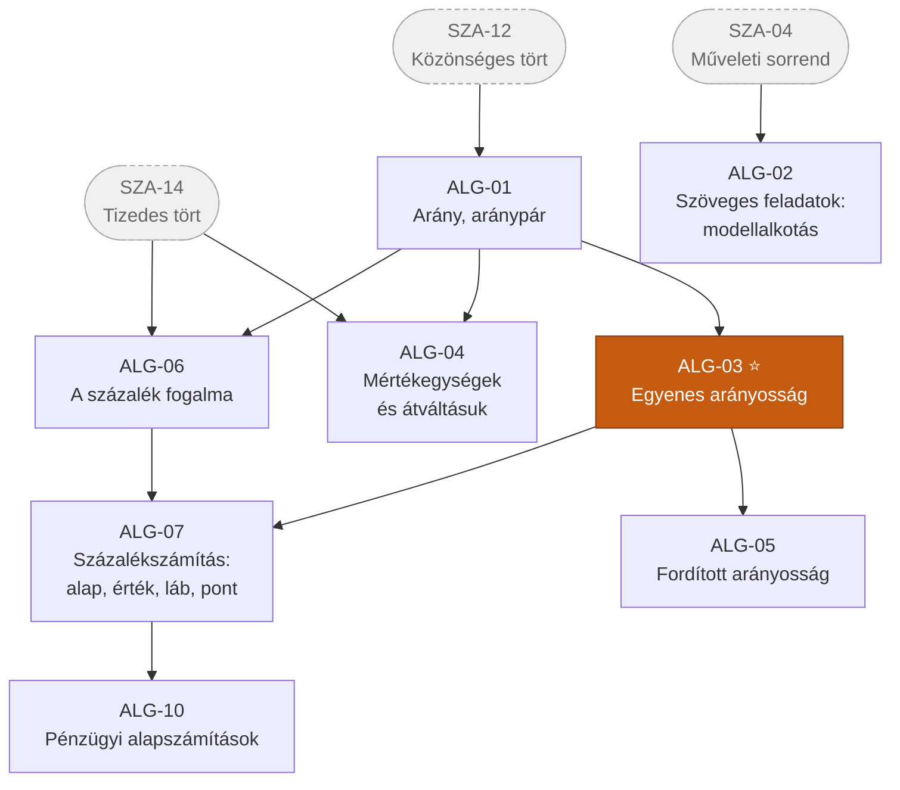
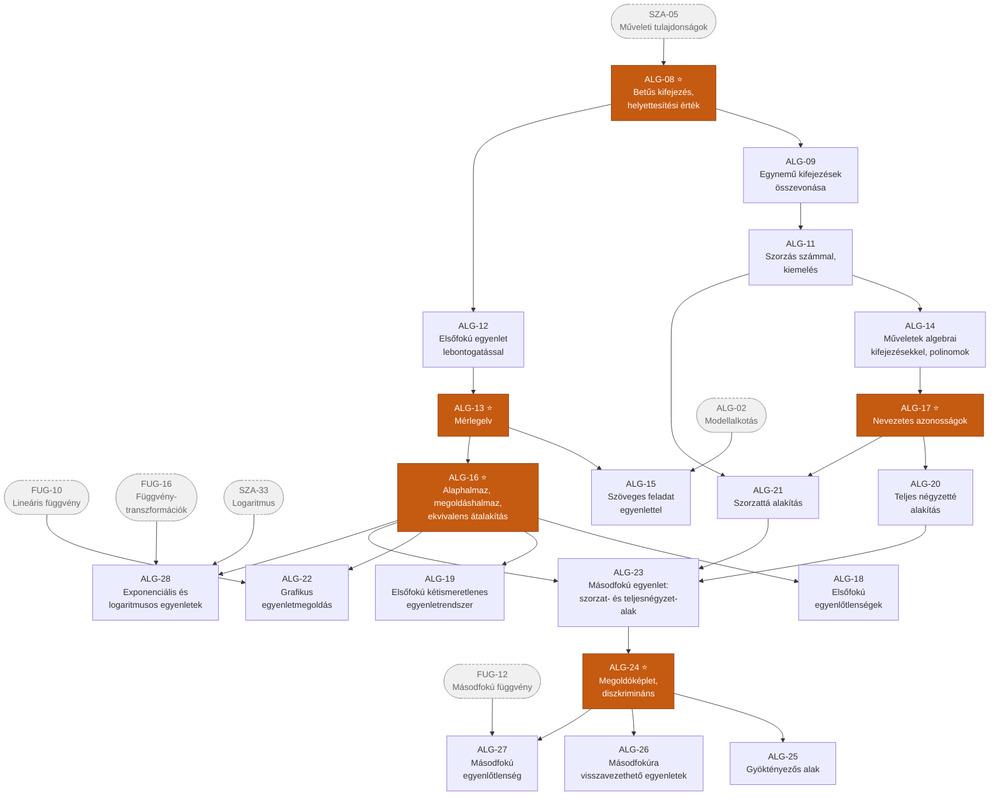

# 3. ág — Algebra és egyenletek

> „Az Absztrakció ága" · kód: `ALG` · 28 csomópont

Ez az ág írja le azt az utat, ahogyan a konkrét számolásból **szimbólumkezelés** lesz.
Két, egymást erősítő szál fut benne:

- **arányosság és százalék** – a mindennapi matematika gerince
- **betűs kifejezések → egyenletek → egyenlőtlenségek** – az érettségi feladatsorok motorja

A `ALG-13` (mérlegelv) és az `ALG-17` (nevezetes azonosságok) a két legfontosabb kapunode:
előbbi nélkül nincs egyenletmegoldás, utóbbi nélkül nincs másodfokú egyenlet.

## Függőségi gráf — arányosság és százalék

## Függőségi gráf — kifejezésektől az egyenletekig

## Csomópontok

### I. szint

| ID | Készség | Leírás | Előfeltétel |
|----|---------|--------|-------------|
| **ALG-01** | Arány, aránypár | Két mennyiség viszonyának kifejezése hányadossal; aránypár felírása és olvasása. A tört fogalmának „relációs" olvasata. | *SZA-12* |
| **ALG-02** | Egyszerű szöveges feladatok: modellalkotás, következtetés | Szövegből a matematikai tartalom kiemelése; megoldás szakaszos ábrázolással, visszafelé gondolkodással, táblázattal. Az ellenőrzés a szövegbe visszahelyettesítéssel. | *SZA-04* |

### II. szint

| ID | Készség | Leírás | Előfeltétel |
|----|---------|--------|-------------|
| **ALG-03** ⭐ | Egyenes arányosság | Két mennyiség együtt változása állandó hányadossal; felismerés hétköznapi helyzetekben; következtetés egyről többre és többről egyre; arányos osztás (adott mennyiség felosztása megadott arányban). | ALG-01 |
| **ALG-04** | Mértékegységek és átváltásuk | Hosszúság, tömeg, idő, terület, térfogat, űrtartalom szabványegységei; átváltás helyiértékes gondolkodással; származtatott mértékegységek (sebesség, sűrűség). | ALG-01, *SZA-14* |
| **ALG-06** | A százalék fogalma | A százalék mint századrész; kapcsolat a törttel és a tizedes törttel; százalékos adatok értelmezése a hétköznapokban. | ALG-01, *SZA-14* |

### III. szint

| ID | Készség | Leírás | Előfeltétel |
|----|---------|--------|-------------|
| **ALG-05** | Fordított arányosság | Két mennyiség együtt változása állandó szorzattal; felismerés munkavégzési, mozgási és mérési helyzetekben. | ALG-03 |
| **ALG-07** | Százalékszámítás: alap, érték, láb, pont | A három alapfeladat (érték, alap, láb keresése); a százalékpont és a százalék megkülönböztetése; egymást követő százalékos változások. | ALG-06, ALG-03 |

### IV. szint

| ID | Készség | Leírás | Előfeltétel |
|----|---------|--------|-------------|
| **ALG-08** ⭐ | Betűs kifejezés, változó, együttható, helyettesítési érték | Betűk használata ismeretlen vagy változó mennyiség jelölésére; egytagú és többtagú kifejezés; helyettesítési érték számolása. | *SZA-05* |

### V. szint

| ID | Készség | Leírás | Előfeltétel |
|----|---------|--------|-------------|
| **ALG-09** | Egynemű kifejezések összevonása | Az egynemű tagok felismerése és összevonása; a rendezés mint a kifejezés egyszerűbb alakra hozása. | ALG-08 |
| **ALG-10** | Pénzügyi alapszámítások | Áremelés és leárazás, egyszerű kamat, keverési feladatok; banki ajánlatok, díjak összehasonlítása; bevétel–kiadás egyensúly. | ALG-07 |
| **ALG-12** | Elsőfokú egyenlet megoldása lebontogatással | A műveletsor „visszafejtése" az ismeretlen felszabadításáig. Intuitív, de csak egyszerű szerkezetű egyenletekre működik. | ALG-08 |

### VI. szint

| ID | Készség | Leírás | Előfeltétel |
|----|---------|--------|-------------|
| **ALG-11** | Szorzás számmal, közös tényező kiemelése | Kéttagú kifejezés szorzása számmal (disztributivitás); a művelet megfordítása: közös tényező kiemelése. | ALG-09 |
| **ALG-13** ⭐ | Mérlegelv | Az egyenlet mint egyensúly; mindkét oldalon azonos átalakítás végzése. Az egyetemes egyenletmegoldó módszer, amely tetszőleges szerkezetre működik. | ALG-12 |

### VII. szint

| ID | Készség | Leírás | Előfeltétel |
|----|---------|--------|-------------|
| **ALG-14** | Műveletek algebrai kifejezésekkel, polinomok | Összeadás, kivonás, szorzás, osztás algebrai kifejezésekkel; egytagú kifejezés hatványa; a polinom fogalma és foka. | ALG-11 |
| **ALG-15** | Szöveges feladat megoldása egyenlettel | Az ismeretlen megválasztása, egyenlet felírása, megoldás, majd értelmezés és ellenőrzés az eredeti szövegben. Út–idő–sebesség, közös munkavégzés, keverés, pénzügyi feladatok. | ALG-13, ALG-02 |
| **ALG-16** ⭐ | Alaphalmaz, megoldáshalmaz, ekvivalens átalakítás | Annak tudatosítása, hogy a megoldáshalmaz az alaphalmaztól függ; ekvivalens és nem ekvivalens lépések megkülönböztetése; hamis gyök és gyökvesztés. | ALG-13 |
| **ALG-17** ⭐ | Nevezetes azonosságok | `(a+b)²`, `(a−b)²`, `(a+b)(a−b)` ismerete, geometriai szemléltetése és kétirányú alkalmazása (kifejtés és szorzattá alakítás). | ALG-14 |

### VIII. szint

| ID | Készség | Leírás | Előfeltétel |
|----|---------|--------|-------------|
| **ALG-18** | Elsőfokú egyenlőtlenségek | Megoldás mérlegelvvel; a negatív számmal való szorzás relációfordító hatása; a megoldáshalmaz megadása intervallummal. | ALG-16 |
| **ALG-19** | Elsőfokú kétismeretlenes egyenletrendszer | Megoldás behelyettesítéssel, egyenlő együtthatók módszerével és grafikusan; a megoldások számának geometriai jelentése. | ALG-16 |
| **ALG-20** | Teljes négyzetté alakítás | Másodfokú kifejezés `a(x+p)² + q` alakra hozása. A másodfokú függvény ábrázolásának és a megoldóképlet levezetésének közös eszköze. | ALG-17 |
| **ALG-21** | Szorzattá alakítás | Kiemelés és nevezetes azonosságok kombinált alkalmazása; a szorzat nulla voltára vonatkozó elv (`ab = 0 ⇔ a = 0 vagy b = 0`). | ALG-17, ALG-11 |
| **ALG-22** | Grafikus egyenletmegoldás | Az egyenlet két oldalának függvényként való ábrázolása; a metszéspontok mint megoldások; közelítő megoldás digitális eszközzel. | ALG-16, *FUG-10* |

### IX. szint

| ID | Készség | Leírás | Előfeltétel |
|----|---------|--------|-------------|
| **ALG-23** | Másodfokú egyenlet: szorzattá alakítás és teljes négyzetté kiegészítés | A két „kézi" megoldási módszer; annak felismerése, melyik egyenletnél melyik gazdaságosabb. | ALG-20, ALG-21, ALG-16 |

### X. szint

| ID | Készség | Leírás | Előfeltétel |
|----|---------|--------|-------------|
| **ALG-24** ⭐ | Megoldóképlet és diszkrimináns | A megoldóképlet levezetése teljes négyzetté alakítással; a diszkrimináns előjele és a valós gyökök száma közti kapcsolat. | ALG-23 |

### XI. szint

| ID | Készség | Leírás | Előfeltétel |
|----|---------|--------|-------------|
| **ALG-25** | Gyöktényezős alak | `a(x−x₁)(x−x₂)` felírása; a gyökök és az együtthatók közti összefüggés; alkalmazás szorzattá alakításnál és szöveges feladatoknál. | ALG-24 |
| **ALG-26** | Másodfokúra visszavezethető egyenletek | Új ismeretlen bevezetése (helyettesítés); a kapott gyökök visszahelyettesítése és ellenőrzése. | ALG-24 |
| **ALG-27** | Másodfokú egyenlőtlenség | Megoldás a parabola grafikonja alapján; előjelvizsgálat a gyöktényezős alakkal; a megoldáshalmaz megadása intervallumokkal. | ALG-24, *FUG-12* |

### XII. szint

| ID | Készség | Leírás | Előfeltétel |
|----|---------|--------|-------------|
| **ALG-28** | Exponenciális és logaritmusos egyenletek, egyenlőtlenségek | Azonos alapra hozás, a definíció alkalmazása, logaritmusvétel; az értelmezési tartomány és a monotonitás figyelembevétele egyenlőtlenségeknél. | *SZA-33*, ALG-16, *FUG-16* |

## Kapcsolódás a többi ághoz

| Innen indul | Ide vezet | Miért |
|---|---|---|
| ALG-03, ALG-05 | FUG-06, FUG-07 | Az arányosságok az első „igazi" függvények. |
| ALG-03 | GEO-21, GEO-22 | A középponti szög egyenesen arányos a körívvel és a körcikk területével. |
| ALG-04 | GEO-15 | Mérés nélkül nincs kerület- és területszámítás. |
| ALG-19 | GEO-60 | Két egyenes metszéspontja egyenletrendszer megoldása. |
| ALG-20 | FUG-12, GEO-61 | Parabola csúcspontja és a kör egyenletének teljes négyzetté alakítása. |
| ALG-10 | FUG-23 | Kamatos kamat = mértani sorozat. |
