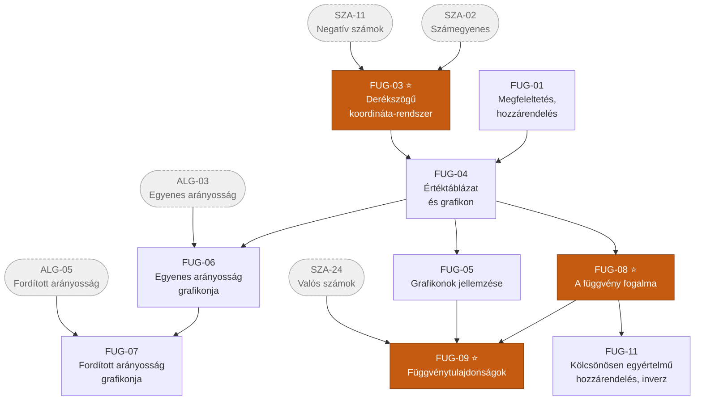
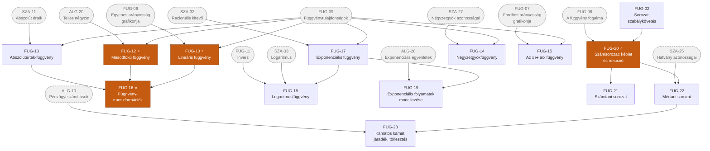

# 4. ág — Függvények és sorozatok

> „A Változás ága" · kód: `FUG` · 23 csomópont

Ez az ág a **kapcsolat** és a **változás** leírásáról szól. Az RPG-analógiával élve ez a
„támogató" ág: kevés önálló feladattípusa van, viszont az `ALG` és a `GEO` ág feladatainak
nagy részét ez teszi láthatóvá és megoldhatóvá.

Az ág két szála a sorozatoknál találkozik újra: a sorozat nem más, mint pozitív egész számokon
értelmezett függvény.

## Függőségi gráf — a függvényfogalom kiépülése

## Függőségi gráf — függvénytípusok és sorozatok

## Csomópontok

### I. szint

| ID | Készség | Leírás | Előfeltétel |
|----|---------|--------|-------------|
| **FUG-01** | Megfeleltetés, hozzárendelés | Két halmaz elemei közötti kapcsolat létrehozása; a kapcsolat szabályának felismerése és megfogalmazása. A függvényfogalom csírája. | — |
| **FUG-02** | Sorozat, szabálykövetés | Számokból, jelekből, alakzatokból álló sorozat folytatása adott szabály szerint; néhány tagból a képzési szabály felismerése. | — |

### II. szint

| ID | Készség | Leírás | Előfeltétel |
|----|---------|--------|-------------|
| **FUG-03** ⭐ | Derékszögű koordináta-rendszer | Tájékozódás a síkon számpárokkal; pont ábrázolása koordinátáiból és koordinátái leolvasása; a négy síknegyed. | *SZA-02*, *SZA-11* |

### III. szint

| ID | Készség | Leírás | Előfeltétel |
|----|---------|--------|-------------|
| **FUG-04** | Értéktáblázat és grafikon | Összetartozó értékpárok táblázatba rendezése, majd ábrázolása koordináta-rendszerben; a grafikon mint a kapcsolat képe. | FUG-01, FUG-03 |

### IV. szint

| ID | Készség | Leírás | Előfeltétel |
|----|---------|--------|-------------|
| **FUG-05** | Grafikonok jellemzése | Növekedés és fogyás, legnagyobb és legkisebb érték, tengelymetszetek leolvasása; hétköznapi grafikonok (hőmérséklet, út–idő) értelmezése. | FUG-04 |
| **FUG-06** | Az egyenes arányosság grafikonja | Az origón átmenő egyenes felismerése és megrajzolása; az arányossági tényező mint meredekség. | FUG-04, *ALG-03* |

### V. szint

| ID | Készség | Leírás | Előfeltétel |
|----|---------|--------|-------------|
| **FUG-07** | A fordított arányosság grafikonja | A hiperbolaág felismerése; annak megértése, miért nem metszi a tengelyeket. | FUG-06, *ALG-05* |
| **FUG-08** ⭐ | A függvény fogalma | Értelmezési tartomány, képhalmaz, értékkészlet; a hozzárendelés egyértelműsége mint döntő kritérium; a függvény megadásának módjai. | FUG-04 |

### VI. szint

| ID | Készség | Leírás | Előfeltétel |
|----|---------|--------|-------------|
| **FUG-09** ⭐ | Függvénytulajdonságok | Zérushely, szélsőérték, monotonitás (növekedés–fogyás), értékkészlet meghatározása grafikonról és képletből. A függvényvizsgálat közös eszköztára. | FUG-08, FUG-05, *SZA-24* |
| **FUG-11** | Kölcsönösen egyértelmű hozzárendelés, inverz | Annak eldöntése, mikor fordítható meg egy hozzárendelés; az inverz függvény grafikonja mint tükörkép az `y = x` egyenesre. | FUG-08 |

### VII. szint

| ID | Készség | Leírás | Előfeltétel |
|----|---------|--------|-------------|
| **FUG-10** ⭐ | Lineáris függvény | `x ↦ mx + b`; a meredekség és a tengelymetszet jelentése; a hozzárendelési szabály leolvasása grafikonról. | FUG-09, FUG-06 |
| **FUG-13** | Abszolútérték-függvény | Az `x ↦ \|x\|` függvény V alakú grafikonja; a törtvonal-szerű töréspont értelmezése. | FUG-09, *SZA-11* |

### VIII. szint

| ID | Készség | Leírás | Előfeltétel |
|----|---------|--------|-------------|
| **FUG-12** ⭐ | Másodfokú függvény | Az `x ↦ ax² + bx + c` függvény parabolája; csúcspont, tengely, nyílásirány meghatározása teljes négyzetté alakítással. | FUG-09, *ALG-20* |
| **FUG-14** | Négyzetgyökfüggvény | Az `x ↦ √x` függvény grafikonja, értelmezési tartománya és monotonitása; kapcsolata a másodfokú függvénnyel. | FUG-09, *SZA-27* |
| **FUG-15** | Az `x ↦ a/x` függvény | A fordított arányosság függvényként; két hiperbolaág, a szakadási hely, az aszimptotikus viselkedés szemléletes leírása. | FUG-09, FUG-07 |
| **FUG-17** | Exponenciális függvény | Az `x ↦ aˣ` függvény; az `a > 1` és a `0 < a < 1` eset megkülönböztetése; állandó szorzóval való növekedés. | FUG-09, *SZA-32* |
| **FUG-20** ⭐ | Számsorozat: megadás képlettel és rekurzióval | A sorozat mint pozitív egész számokon értelmezett függvény; explicit képlet és rekurzív megadás közti különbség. | FUG-02, FUG-08 |

### IX. szint

| ID | Készség | Leírás | Előfeltétel |
|----|---------|--------|-------------|
| **FUG-16** ⭐ | Függvénytranszformációk | `f(x) + c`, `f(x + c)`, `c · f(x)`, `\|f(x)\|` hatása a grafikonra; összetett grafikonok felépítése lépésenként az alapfüggvényből. | FUG-10, FUG-12, FUG-13 |
| **FUG-18** | Logaritmusfüggvény | Az exponenciális függvény inverze; grafikonja, értelmezési tartománya, monotonitása. | FUG-17, *SZA-33*, FUG-11 |
| **FUG-21** | Számtani sorozat | Állandó különbség (differencia); az n-edik tag és az első n tag összegének képlete, és a képlet bizonyítása. | FUG-20 |
| **FUG-22** | Mértani sorozat | Állandó hányados (kvóciens); az n-edik tag és az első n tag összegének képlete, és a képlet bizonyítása. | FUG-20, *SZA-25* |

### X. szint

| ID | Készség | Leírás | Előfeltétel |
|----|---------|--------|-------------|
| **FUG-19** | Exponenciális folyamatok modellezése | Népességnövekedés, radioaktív bomlás, kamatos kamat, járványterjedés leírása; adatokra függvény illesztése és a paraméterek értelmezése. | FUG-17, *ALG-28* |
| **FUG-23** | Kamatos kamat, gyűjtőjáradék, törlesztőrészlet | Tőke, kamatláb, futamidő; a mértani sorozat és összegképletének alkalmazása megtakarítási, befektetési és hitelfelvételi feladatokra, a kockázatok mérlegelésével. | FUG-22, *ALG-10* |

## Kapcsolódás a többi ághoz

| Innen indul | Ide vezet | Miért |
|---|---|---|
| FUG-03 | GEO-56 | A koordinátageometria a koordináta-rendszerre épül. |
| FUG-10 | ALG-22, GEO-59 | Grafikus egyenletmegoldás és az egyenes egyenlete. |
| FUG-12 | ALG-27 | A másodfokú egyenlőtlenséget a parabola képe oldja meg. |
| FUG-16 | ALG-28 | A monotonitás dönti el az exponenciális egyenlőtlenség irányát. |
| FUG-22 | ESE-29 | Geometriai eloszlás jellegű valószínűségi feladatok. |

## Megjegyzés a trigonometrikus függvényekhez

A középszintű kerettanterv a szögfüggvényeket **geometriai eszközként** tárgyalja
(derékszögű háromszög, szinusz- és koszinusztétel), nem pedig önálló függvénytípusként.
Ezért a `sin`, `cos`, `tg` a [Geometria ág](05-geometria.md) `GEO-40`–`GEO-45` csomópontjai
között szerepel. Emelt szinten ezek természetes módon kapcsolódnának ide a `FUG-16`
(függvénytranszformációk) után.
