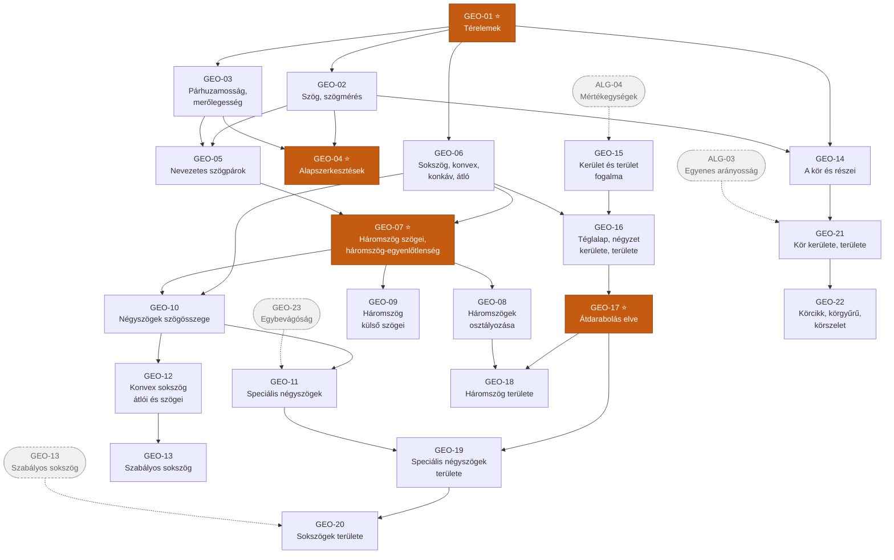
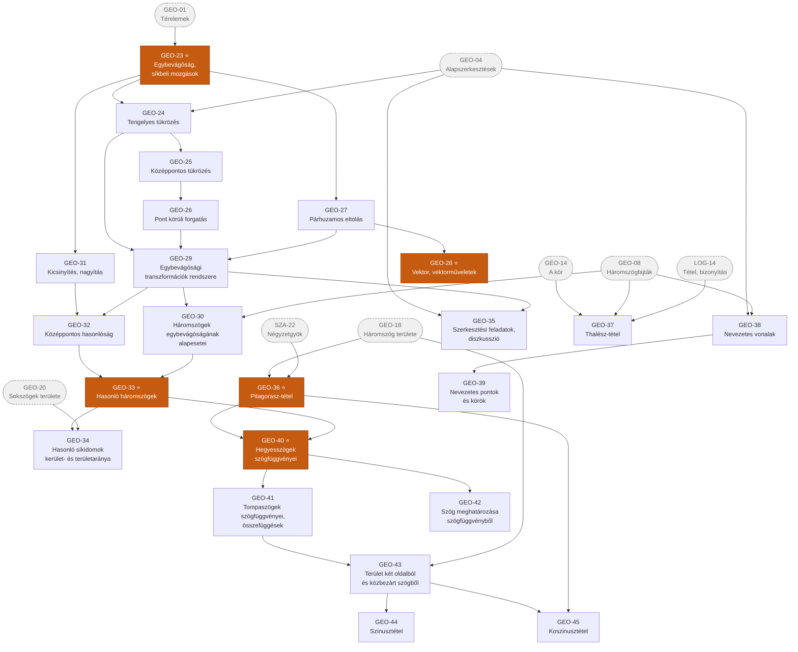
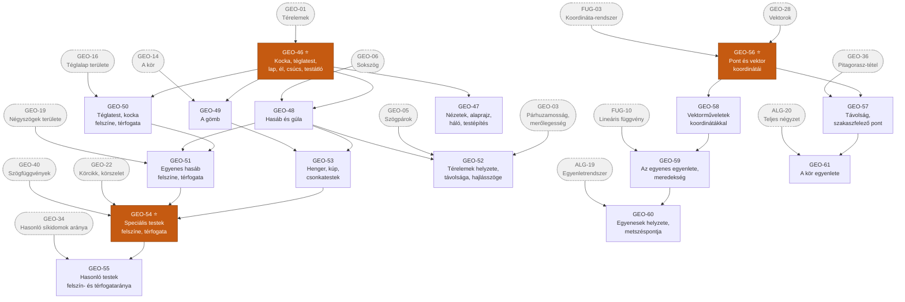

# 5. ág — Geometria

> „A Tér ága" · kód: `GEO` · 61 csomópont

A legnagyobb ág, öt jól elkülönülő szakasszal:

| Szakasz | Csomópontok | Mi történik itt |
|---|---|---|
| **Alapok és síkidomok** | `GEO-01`–`GEO-14` | Fogalomépítés: térelemek, szögek, háromszögek, négyszögek, kör |
| **Mérés** | `GEO-15`–`GEO-22` | Kerület és terület; az átdarabolás mint univerzális módszer |
| **Transzformációk** | `GEO-23`–`GEO-35` | Egybevágóság és hasonlóság; vektorok |
| **Nevezetes tételek és trigonometria** | `GEO-36`–`GEO-45` | Pitagorasz, Thalész, szögfüggvények, szinusz- és koszinusztétel |
| **Tér- és koordinátageometria** | `GEO-46`–`GEO-61` | Testek, felszín, térfogat; a geometria algebrai leírása |

## Függőségi gráf — alapok, síkidomok, mérés

## Függőségi gráf — transzformációk és nevezetes tételek

## Függőségi gráf — tér- és koordinátageometria

---

## Csomópontok — Alapok és síkidomok

| ID | Készség | Leírás | Előfeltétel |
|----|---------|--------|-------------|
| **GEO-01** ⭐ | Térelemek: pont, egyenes, sík; szakasz, félegyenes | A geometria alapfogalmai; egyenes, félegyenes és szakasz megkülönböztetése; illeszkedés. | — |
| **GEO-02** | Szög, szögmérés, szögfajták | A szögtartomány mint síkrész; mérés fokban (és szögpercben); hegyes-, derék-, tompa-, egyenes-, homorú- és teljesszög. | GEO-01 |
| **GEO-03** | Párhuzamosság és merőlegesség | Egyenesek kölcsönös helyzete a síkban; két pont, pont és egyenes, két párhuzamos egyenes távolsága. | GEO-01 |
| **GEO-04** ⭐ | Alapszerkesztések | Szakaszfelező merőleges, szögfelező, merőleges és párhuzamos egyenes szerkesztése, szögmásolás – körzővel és egyélű vonalzóval, illetve dinamikus geometriai szoftverrel. Ezek a további szerkesztések „építőkockái". | GEO-02, GEO-03 |
| **GEO-05** | Nevezetes szögpárok | Pótszögek, mellékszögek, kiegészítő szögek, csúcsszögek, egyállású szögek, váltószögek – és a párhuzamos szelők tulajdonságai. | GEO-02, GEO-03 |
| **GEO-06** | Sokszög; konvex és konkáv; átló | Zárt töröttvonal által határolt síkidom; a konvexitás szemléletes és pontos jelentése; az átló fogalma. | GEO-01 |
| **GEO-07** ⭐ | Háromszög szögei, háromszög-egyenlőtlenség | A belső szögek összege 180°, és ennek bizonyítása párhuzamos szelőkkel; annak feltétele, hogy három szakaszból háromszög szerkeszthető. | GEO-06, GEO-05 |
| **GEO-08** | Háromszögek osztályozása | Csoportosítás szögek szerint (hegyes-, derék-, tompaszögű) és oldalak szerint (általános, egyenlő szárú, szabályos); a tengelyesen szimmetrikus háromszögek. | GEO-07 |
| **GEO-09** | A háromszög külső szögei | A külső szög és a nem mellette fekvő belső szögek kapcsolata; a külső szögek összege 360°. | GEO-07 |
| **GEO-10** | Négyszögek: belső és külső szögösszeg | A 360°-os belső szögösszeg levezetése átlóval való háromszögekre bontással; konvex és konkáv négyszögek. | GEO-06, GEO-07 |
| **GEO-11** | Speciális négyszögek és halmazábrájuk | Trapéz, húrtrapéz, paralelogramma, deltoid, rombusz, téglalap, négyzet tulajdonságai (oldalak, szögek, átlók, szimmetriák) és tartalmazási viszonyaik. | GEO-10, GEO-23 |
| **GEO-12** | Konvex sokszög átlói és szögösszege | Az `n(n−3)/2` átlószám és az `(n−2)·180°` belső szögösszeg tétele, bizonyítással. | GEO-10 |
| **GEO-13** | Szabályos sokszög | Egyenlő oldalak és egyenlő szögek; a középponti szög, a körülírt és a beírt kör. | GEO-12 |
| **GEO-14** | A kör és részei | Körvonal és körlap; középpont, sugár, húr, átmérő, szelő, érintő, körív, körcikk, körszelet; a középponti szög. | GEO-01, GEO-02 |

## Csomópontok — Mérés: kerület és terület

| ID | Készség | Leírás | Előfeltétel |
|----|---------|--------|-------------|
| **GEO-15** | Kerület és terület fogalma, mérése | A mérés alapelve: egységválasztás és összehasonlítás; a terület mint lefedés egységnégyzetekkel; alkalmi és szabványegységek. | *ALG-04* |
| **GEO-16** | Téglalap és négyzet kerülete, területe | Az `a · b` területképlet megalapozása; a kerület és a terület független változása azonos alakzatcsaládon belül. | GEO-15, GEO-06 |
| **GEO-17** ⭐ | Az átdarabolás elve | Annak felismerése, hogy egy alakzat darabokra vágva és átrendezve ugyanakkora területű. Ez az elv adja meg szinte az összes további területképletet. | GEO-16 |
| **GEO-18** | A háromszög területe | Az `a · mₐ / 2` képlet levezetése átdarabolással vagy paralelogrammából; a magasság megválasztásának szabadsága. | GEO-17, GEO-08 |
| **GEO-19** | Speciális négyszögek területe | Paralelogramma, trapéz, deltoid, rombusz területképletei, mindegyik átdarabolással megalapozva. | GEO-17, GEO-11 |
| **GEO-20** | Sokszögek területe | Tetszőleges sokszög területének meghatározása háromszögekre bontással vagy átdarabolással; szabályos sokszög területe. | GEO-19, GEO-13 |
| **GEO-21** | A kör kerülete és területe | A π mint állandó arány; a `2rπ` és az `r²π` képlet szemléletes megalapozása; a kör mint sokszögek határhelyzete. | GEO-14, *ALG-03* |
| **GEO-22** | Körív, körcikk, körgyűrű, körszelet | Annak alkalmazása, hogy a középponti szög egyenesen arányos az ívhosszal és a körcikk területével; összetett síkidomok kerülete és területe. | GEO-21, *ALG-03* |

## Csomópontok — Transzformációk

| ID | Készség | Leírás | Előfeltétel |
|----|---------|--------|-------------|
| **GEO-23** ⭐ | Egybevágóság, síkbeli mozgások | Az „ugyanolyan alakú és méretű" viszony; egybevágó alakzatok felismerése; a mozgatás mint alakzatokat átvivő leképezés. | GEO-01 |
| **GEO-24** | Tengelyes tükrözés és tengelyes szimmetria | A transzformáció tulajdonságai (távolság- és szögtartás, körüljárási irány megfordítása); tükörkép szerkesztése; szimmetriatengely keresése. | GEO-23, GEO-04 |
| **GEO-25** | Középpontos tükrözés és középpontos szimmetria | A 180°-os elforgatásként is felfogható tükrözés; tulajdonságai és szerkesztése; középpontosan szimmetrikus alakzatok. | GEO-24 |
| **GEO-26** | Pont körüli forgatás | Forgásközéppont és forgásszög; a forgatás mint két tengelyes tükrözés egymásutánja; forgásszimmetria. | GEO-25 |
| **GEO-27** | Párhuzamos eltolás | Irány, irányítás és nagyság megadása; az eltolás mint két párhuzamos tengelyű tükrözés eredője. | GEO-23 |
| **GEO-28** ⭐ | Vektor, vektorműveletek | A vektor fogalmának kialakítása az eltolásból; abszolút érték, nullvektor, ellentett vektor, helyvektor; összeadás, kivonás, számmal való szorzás. | GEO-27 |
| **GEO-29** | Az egybevágósági transzformációk rendszere | A négy alaptranszformáció összehasonlítása és egymás utáni végrehajtása; alkalmazásuk feladatmegoldásban és bizonyításban; parkettázás. | GEO-24, GEO-26, GEO-27 |
| **GEO-30** | Háromszögek egybevágóságának alapesetei | Az SSS, SAS, ASA és SsA esetek; alkalmazásuk szerkesztéseknél és bizonyításoknál. | GEO-29, GEO-08 |
| **GEO-31** | Kicsinyítés és nagyítás | Az alakhű méretváltoztatás felismerése hétköznapi helyzetekben: térkép, makett, fénykép, tervrajz. | GEO-23 |
| **GEO-32** | Középpontos hasonlóság és hasonlósági transzformáció | Hasonlósági középpont és arány; a transzformáció tulajdonságai; a hasonlóság mint középpontos hasonlóság és egybevágóság egymásutánja. | GEO-31, GEO-29 |
| **GEO-33** ⭐ | Hasonló háromszögek | A hasonlóság alapesetei; párhuzamos szelők tétele; alkalmazás magasság- és távolságmérésre („Thalész-módszer"). | GEO-32, GEO-30 |
| **GEO-34** | Hasonló síkidomok kerületének és területének aránya | A kerület aránya `λ`, a területé `λ²` – és annak megértése, miért nem ugyanaz a kettő. | GEO-33, GEO-20 |
| **GEO-35** | Szerkesztési feladatok, diszkusszió | Több feltételnek megfelelő ábra szerkesztése: elemzés, szerkesztés, bizonyítás, diszkusszió. A megoldások számának vizsgálata. | GEO-04, GEO-29 |

## Csomópontok — Nevezetes tételek és trigonometria

| ID | Készség | Leírás | Előfeltétel |
|----|---------|--------|-------------|
| **GEO-36** ⭐ | Pitagorasz-tétel és megfordítása | `a² + b² = c²` derékszögű háromszögben; bizonyítás átdarabolással; a megfordítás használata a derékszögűség igazolására; pitagoraszi számhármasok. | GEO-18, *SZA-22* |
| **GEO-37** | Thalész-tétel és megfordítása | A kör átmérője fölé rajzolt kerületi szög derékszög; bizonyítás egyenlő szárú háromszögekkel; alkalmazás érintőszerkesztésnél. | GEO-14, GEO-08, *LOG-14* |
| **GEO-38** | A háromszög nevezetes vonalai | Oldalfelező merőleges, szögfelező, magasságvonal, súlyvonal, középvonal – definícióik és alaptulajdonságaik. | GEO-04, GEO-08 |
| **GEO-39** | A háromszög nevezetes pontjai és körei | Az oldalfelező merőlegesek és a belső szögfelezők metszéspontjára vonatkozó tétel bizonyítása; körülírt és beírt kör; súlypont, magasságpont. | GEO-38 |
| **GEO-40** ⭐ | Hegyesszögek szögfüggvényei | Szinusz, koszinusz, tangens definíciója derékszögű háromszögben; a definíció jogosságának hasonlóságon alapuló indoklása; számítások gyakorlati helyzetekben. | GEO-36, GEO-33 |
| **GEO-41** | Tompaszögek szögfüggvényei, összefüggések | A szögfüggvények kiterjesztése tompaszögre; a pitagoraszi összefüggés (`sin²α + cos²α = 1`), a pótszögek és mellékszögek szögfüggvényei; `tg α = sin α / cos α`. | GEO-40 |
| **GEO-42** | Szög meghatározása szögfüggvény értékéből | Az inverz szögfüggvények használata számológéppel; a több lehetséges megoldás mérlegelése a feladat kontextusában. | GEO-40 |
| **GEO-43** | Háromszög területe két oldalból és a közbezárt szögből | A `T = (a·b·sin γ)/2` képlet levezetése és alkalmazása; négyszögek és szabályos sokszögek területe szögfüggvényekkel. | GEO-41, GEO-18 |
| **GEO-44** | Szinusztétel | `a / sin α = b / sin β = c / sin γ = 2R`; a tétel bizonyítása; alkalmazása háromszög hiányzó adatainak meghatározására. | GEO-43 |
| **GEO-45** | Koszinusztétel | `c² = a² + b² − 2ab·cos γ` mint a Pitagorasz-tétel általánosítása; alkalmazása, ha két oldal és a közbezárt szög, vagy mindhárom oldal ismert. | GEO-43, GEO-36 |

## Csomópontok — Térgeometria

| ID | Készség | Leírás | Előfeltétel |
|----|---------|--------|-------------|
| **GEO-46** ⭐ | Kocka és téglatest; lap, él, csúcs, lapátló, testátló | A testek elemeinek megnevezése és megszámlálása; a határoló lapok egymáshoz viszonyított helyzete. | GEO-01 |
| **GEO-47** | Nézetek, alaprajz, háló, testépítés | Test és síkbeli ábrázolása közti oda-vissza fordítás; háló készítése és hálóból való építés. A térszemlélet alapgyakorlata. | GEO-46 |
| **GEO-48** | Hasáb és gúla | Alaplap, oldallap, alapél, oldalél, testmagasság; egyenes és ferde hasáb; szabályos gúla, tetraéder. | GEO-46, GEO-06 |
| **GEO-49** | A gömb | A gömb mint adott ponttól egyenlő távolságra lévő pontok halmaza; síkmetszetei; a gömb mint a Föld modellje (hosszúsági és szélességi körök). | GEO-46, GEO-14 |
| **GEO-50** | Téglatest és kocka felszíne, térfogata | A felszín mint a háló területe; a térfogat mint egységkockákkal való kitöltés; az `a·b·c` képlet megalapozása. | GEO-46, GEO-16 |
| **GEO-51** | Egyenes hasáb felszíne és térfogata | `A = 2T_alap + P_alap · m` és `V = T_alap · m`; a képleteket megalapozó összefüggések megértése. | GEO-50, GEO-48, GEO-19 |
| **GEO-52** | Térelemek kölcsönös helyzete, távolsága, hajlásszöge | Egyenesek és síkok illeszkedése, párhuzamossága, kitérő helyzete; pont–sík és egyenes–sík távolság; lapszög. | GEO-03, GEO-05, GEO-48 |
| **GEO-53** | Forgástestek és csonkatestek | Henger, kúp, csonkagúla, csonkakúp; alkotó, palást, forgástengely; síkidomok forgatásával keletkező testek. | GEO-48, GEO-49 |
| **GEO-54** ⭐ | Speciális testek felszíne és térfogata | Hasáb, henger, gúla, kúp, gömb, csonkagúla, csonkakúp felszíne és térfogata; összetett testek és a mindennapi élet tárgyainak számításai. | GEO-53, GEO-51, GEO-22, GEO-40 |
| **GEO-55** | Hasonló testek felszínének és térfogatának aránya | A felszín aránya `λ²`, a térfogaté `λ³`; alkalmazás modellek és makettek méretezésénél. | GEO-54, GEO-34 |

## Csomópontok — Koordinátageometria

| ID | Készség | Leírás | Előfeltétel |
|----|---------|--------|-------------|
| **GEO-56** ⭐ | Pont és vektor koordinátái | Pont és helyvektor megadása számpárral; annak felismerése, hogy ettől kezdve a geometriai állítások algebrai számolássá alakíthatók. | GEO-28, *FUG-03* |
| **GEO-57** | Két pont távolsága, szakaszfelező pont | A távolságképlet levezetése a Pitagorasz-tételből; a felezőpont koordinátái a végpontokból. | GEO-56, *GEO-36* |
| **GEO-58** | Vektorműveletek koordinátákkal | Összeg, különbség és számszoros koordinátái; a vektor abszolút értéke; alkalmazás geometriai feladatokban. | GEO-56 |
| **GEO-59** | Az egyenes egyenlete, meredekség | Az `y = mx + b` és az `x = c` alak; a meredekség geometriai jelentése; egyenesek merőlegességének és párhuzamosságának feltétele a meredekségekkel. | GEO-58, *FUG-10* |
| **GEO-60** | Egyenesek kölcsönös helyzete, metszéspontja | A metszéspont meghatározása egyenletrendszer megoldásával; a megoldások száma és a geometriai helyzet kapcsolata. | GEO-59, *ALG-19* |
| **GEO-61** | A kör egyenlete | `(x − u)² + (y − v)² = r²` felírása és értelmezése; a középpont és a sugár kiolvasása teljes négyzetté alakítással. | GEO-57, *ALG-20* |

## Kapcsolódás a többi ághoz

| Innen indul | Ide vezet | Miért |
|---|---|---|
| GEO-20 | ESE-28 | A geometriai valószínűség területarányokon alapul. |
| GEO-28 | FUG — | A vektor a fizikai és geometriai modellezés közös nyelve. |
| GEO-36 | SZA-24 | A √2 mint egységnégyzet átlója: itt jelenik meg először irracionális szám geometriailag. |
| GEO-17 | ALG-17 | A nevezetes azonosságok geometriai megjelenítése ugyanaz az átdarabolási gondolat. |
