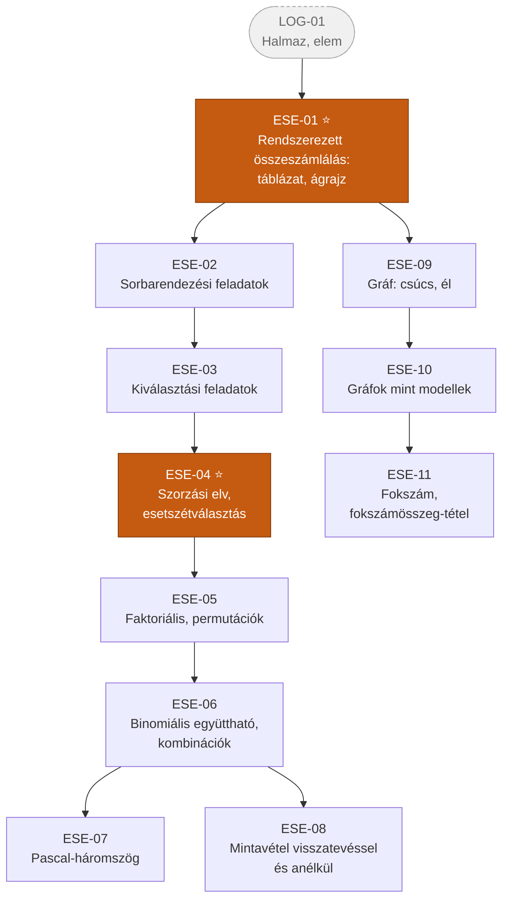
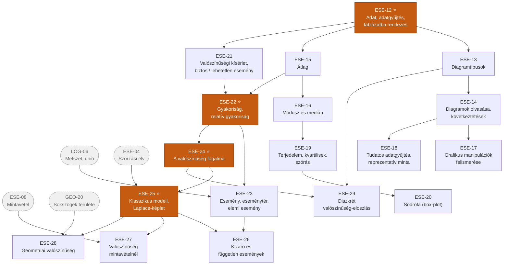

# 6. ág — Kombinatorika, statisztika és valószínűség

> „Az Esély ága" · kód: `ESE` · 29 csomópont

Ez az ág a **bizonytalanság kezeléséről** szól. Három, sokáig párhuzamosan futó szála van,
amelyek a valószínűség fogalmánál kapcsolódnak össze:

- **kombinatorika és gráfok** – hányféleképpen lehetséges?
- **leíró statisztika** – mit mondanak a már megtörtént adatok?
- **valószínűség** – mire számíthatunk?

A `ESE-25` (klasszikus valószínűségi modell) az a pont, ahol a kombinatorika és a valószínűség
egyetlen eszközzé olvad össze: a „kedvező / összes" hányadoshoz össze kell tudni számolni
mindkettőt.

## Függőségi gráf — kombinatorika és gráfok

## Függőségi gráf — statisztika és valószínűség

---

## Csomópontok — Kombinatorika

| ID | Készség | Leírás | Előfeltétel |
|----|---------|--------|-------------|
| **ESE-01** ⭐ | Rendszerezett összeszámlálás: táblázat, ágrajz | Az összes eset áttekintése rendszerezési sémákkal; annak biztosítása, hogy semmi ne maradjon ki és semmit ne számoljunk kétszer. | *LOG-01* |
| **ESE-02** | Sorbarendezési feladatok | Kis elemszámú halmaz elemeinek sorba rendezése, egyenes mentén és kör mentén is; azonos elemeket tartalmazó esetek. | ESE-01 |
| **ESE-03** | Kiválasztási feladatok | Adott elemszámú részhalmaz kiválasztása a sorrend figyelembevételével és anélkül; a két eset megkülönböztetése. | ESE-02 |
| **ESE-04** ⭐ | Szorzási elv, esetszétválasztás | Független döntéssorozat lehetőségeinek összeszorzása; kizáró esetek lehetőségeinek összeadása. A kombinatorika két alapelve. | ESE-03 |
| **ESE-05** | Faktoriális, permutációk | Az `n!` jelentése és kiszámítása; `n` különböző elem sorrendjeinek száma; ismétléses permutáció egyszerű esetekben. | ESE-04 |
| **ESE-06** | Binomiális együttható, kombinációk | Az `n alatt a k` fogalma és értékének kiszámítása; `k` elem kiválasztása `n` elemből sorrend nélkül. | ESE-05 |
| **ESE-07** | Pascal-háromszög | A háromszög felépítése és tulajdonságai; kapcsolata a binomiális együtthatókkal és a kéttagú összeg hatványaival. | ESE-06 |
| **ESE-08** | Mintavétel visszatevéssel és visszatevés nélkül | A két mintavételi eljárás megkülönböztetése; annak felismerése, melyik feladatszöveg melyiket írja le. | ESE-06 |

## Csomópontok — Gráfok

| ID | Készség | Leírás | Előfeltétel |
|----|---------|--------|-------------|
| **ESE-09** | Gráf: csúcs, él | A gráf mint kapcsolatok ábrázolása; csúcsok és élek; egyszerű gráf, teljes gráf. | ESE-01 |
| **ESE-10** | Gráfok mint modellek | Kézfogások, körmérkőzések, ismeretségek, családfák, útvonalak szemléltetése és feladatok megoldása gráffal; esetszétválasztás áttekintése fagráffal. | ESE-09 |
| **ESE-11** | Fokszám, fokszámösszeg-tétel | Egy csúcs fokszáma; annak felismerése és alkalmazása, hogy a fokszámok összege az élek számának kétszerese. | ESE-10 |

## Csomópontok — Leíró statisztika

| ID | Készség | Leírás | Előfeltétel |
|----|---------|--------|-------------|
| **ESE-12** ⭐ | Adat, adatgyűjtés, táblázatba rendezés | Adatok gyűjtése hagyományos és digitális forrásból; rendszerezés táblázatba; az adatsokaság fogalma. | — |
| **ESE-13** | Diagramtípusok | Oszlop-, kör-, vonal- és pontdiagram készítése és olvasása; a megfelelő ábrázolási mód kiválasztása az adatok és a kérdés jellege alapján. | ESE-12 |
| **ESE-14** | Diagramok olvasása, megfeleltetése, következtetések | Adatok kigyűjtése táblázatból és diagramról adott szempont szerint; különböző típusú diagramok megfeleltetése egymásnak; következtetések megfogalmazása. | ESE-13 |
| **ESE-15** | Átlag | A számtani közép kiszámítása és értelmezése; annak felismerése, mikor félrevezető. | ESE-12 |
| **ESE-16** | Módusz és medián | A leggyakoribb és a középső adat meghatározása; a három középérték összehasonlítása ugyanazon adatsoron; melyik mit mond el. | ESE-15 |
| **ESE-17** | Grafikus manipulációk felismerése | Csonkolt tengely, torzított lépték, félrevezető területarányok felismerése és a diagram javítása. Adatműveltségi alapkészség. | ESE-14 |
| **ESE-18** | Tudatos adatgyűjtés, reprezentatív minta | Az adatgyűjtés megtervezése adott cél érdekében; a reprezentativitás szemléletes fogalma; példák reprezentatív és nem reprezentatív mintára. | ESE-14 |
| **ESE-19** | Terjedelem, kvartilisek, szórás | Szóródási mutatók: minimum, maximum, terjedelem, alsó és felső kvartilis, szórás; a kiugró adat kezelése. | ESE-16 |
| **ESE-20** | Sodrófa (box-plot) diagram | A doboz-ábra elkészítése és olvasása; adathalmazok gyors összehasonlítása több box-plot egymás mellé helyezésével. | ESE-19 |

## Csomópontok — Valószínűség

| ID | Készség | Leírás | Előfeltétel |
|----|---------|--------|-------------|
| **ESE-21** | Valószínűségi kísérlet; biztos, lehetséges, lehetetlen esemény | Kísérletek végzése dobókockával, pénzérmével, golyókkal; a három eseménytípus megkülönböztetése; intuitív esélylatolgatás. | ESE-12 |
| **ESE-22** ⭐ | Gyakoriság és relatív gyakoriság | Egy esemény bekövetkezéseinek száma és aránya; annak megfigyelése, hogy a relatív gyakoriság nagy elemszámnál stabilizálódik. | ESE-21, ESE-15 |
| **ESE-23** | Esemény, eseménytér, elemi esemény | Az összes lehetséges kimenetel halmaza; az esemény mint az eseménytér részhalmaza; összetett események leírása halmazműveletekkel. | ESE-22, *LOG-06* |
| **ESE-24** ⭐ | A valószínűség fogalma | A valószínűség bevezetése statisztikai alapon: az az érték, amely köré a relatív gyakoriság stabilizálódik. A valószínűség tulajdonságai. | ESE-22 |
| **ESE-25** ⭐ | Klasszikus valószínűségi modell, Laplace-képlet | Egyenlő esélyű elemi események esetén `P = kedvező / összes`; a modell alkalmazhatóságának feltétele; a számláló és a nevező összeszámlálása kombinatorikával. | ESE-24, *ESE-04* |
| **ESE-26** | Egymást kizáró és független események | A két fogalom megkülönböztetése (és annak felismerése, hogy nem ugyanaz); az összeg- és a szorzatszabály egyszerű alkalmazása. | ESE-23, ESE-25 |
| **ESE-27** | Valószínűség mintavételnél | Valószínűség meghatározása visszatevéses és visszatevés nélküli mintavétel esetén; a két eset eltérő összeszámlálása. | ESE-25, ESE-08 |
| **ESE-28** | Geometriai valószínűség | Valószínűség hossz-, terület- vagy térfogatarányként, ha a kimenetelek nem megszámlálhatóak. | ESE-25, *GEO-20* |
| **ESE-29** | Diszkrét valószínűség-eloszlás | A lehetséges értékek és a hozzájuk tartozó valószínűségek táblázata; ábrázolás oszlopdiagrammal; annak ellenőrzése, hogy a valószínűségek összege 1. | ESE-24, ESE-13 |

## Kapcsolódás a többi ághoz

| Innen indul | Ide vezet | Miért |
|---|---|---|
| ESE-01 | LOG-13 | A logikai szita rendszerezett összeszámlálás halmazokra. |
| ESE-04 | ESE-25 | A Laplace-képlet nevezőjének kiszámításához szorzási elv kell. |
| ESE-15 | FUG-05 | Az átlag és a grafikonolvasás közös adatszemlélete. |
| ESE-13 | FUG-04 | A diagram és a függvénygrafikon ugyanazon ábrázolási kultúra része. |
